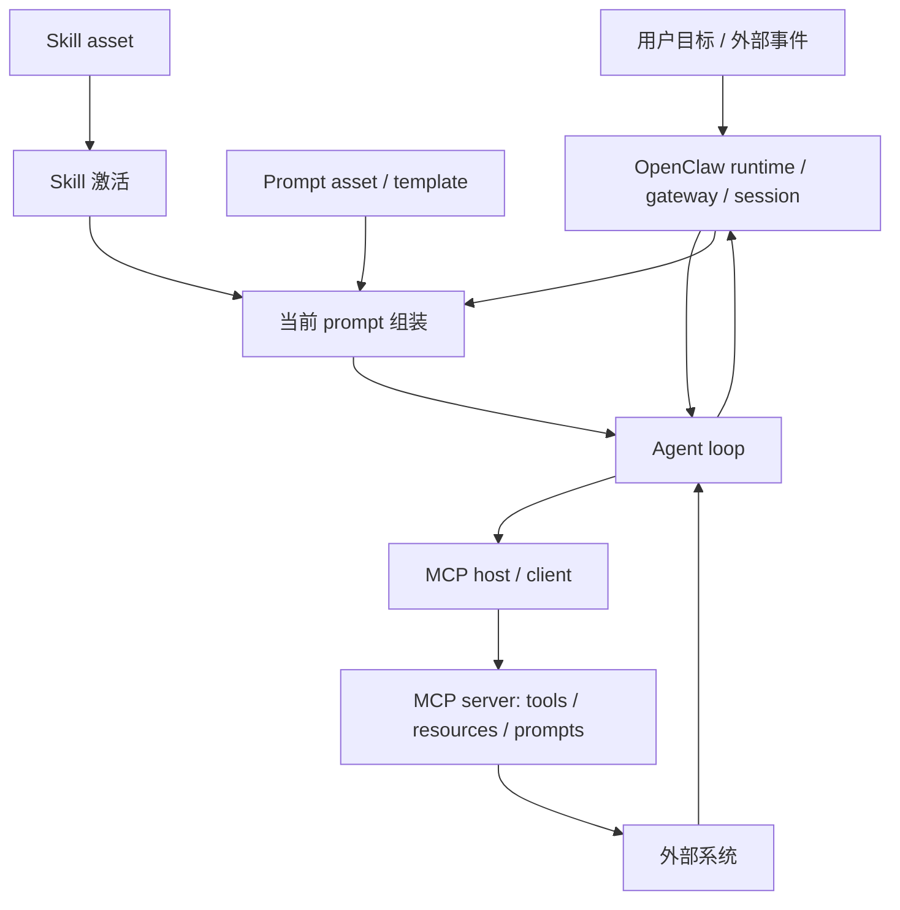

# AI 代理栈分层：Agent、MCP、Skill、Prompt 与 OpenClaw 的概念边界

## 1. 这份文档要帮你学会什么

这篇文档不是词汇表，也不是某个产品的功能介绍。  
它要帮你把 `Agent`、`Prompt`、`Skill`、`MCP` 和 `OpenClaw` 压成一张可以反复调用的分层地图。

读完后，你应该至少能做到：

- 分清哪些问题属于执行闭环，哪些属于当前输入控制，哪些属于可复用工作方法，哪些属于能力协议，哪些属于产品运行时
- 判断一个系统的问题更可能出在 agent loop、prompt stack、skill 激活、MCP capability contract，还是 runtime / gateway
- 识别“工具很多但没有 agent”“prompt 很长但没有 skill”“有 MCP 但没有运行时治理”的伪分层
- 把 OpenClaw 这类长期在线代理平台，与一般聊天应用、单步 coding assistant、工作流系统区分开

如果你现在主要缺基础概念，建议按这个顺序继续读：

1. [agent.md](./agent.md)
2. [prompt.md](./prompt.md)
3. [skill.md](./skill.md)
4. [mcp.md](./mcp.md)
5. 再回到这篇文档看整栈关系

## 2. 一句话结论 / 问题定义

**Agent 负责目标驱动执行闭环，Prompt 负责当前轮次输入控制面，Skill 负责可复用工作方法资产，MCP 负责把 tools / resources / prompts 标准化接入，OpenClaw 负责把会话、gateway、runtime 与 agent loop 编排成长期在线的产品系统。**

这组概念真正要解决的问题不是“AI 里为什么又多出几个名词”，而是：

- 复杂代理系统到底应该怎样拆层
- 为什么“超长 prompt + 一堆工具”通常撑不起稳定系统
- 为什么长期在线代理一定会碰到权限、会话、审计和运行时边界问题

## 3. 对象边界与相邻概念

这篇文档里的五个对象边界是：

- `Agent`
  围绕目标、状态、动作、反馈和停止条件形成的执行闭环。

- `Prompt`
  当前轮次真正送进模型的输入控制面。  
  它可以包含 system / developer / user / context / tool result / output constraint，但它首先说的是“本轮输入”，不是任何提示资产的总称。

- `Skill`
  把一类任务中的 SOP、判断顺序、边界和完成标准沉淀成可复用行为资产。  
  它通常通过 prompt、agent 配置、workflow 或其他承载形式进入当前执行，但 skill 本体不等于这些承载形式。

- `MCP`
  用 host / client / server 结构，把 tools、resources 和 prompts 作为协议原语标准化接入 AI 应用的能力协议层。

- `OpenClaw`
  把 gateway、session、node connection、agent runtime、agent loop 和多通道交互编排起来的产品运行时。

它们分别不等于：

- `Agent` 不等于“会聊天的模型”
- `Prompt` 不等于“任意一段写给模型的文字”
- `Skill` 不等于“更长的 prompt”
- `MCP` 不等于“某个具体工具包”或“安全方案本身”
- `OpenClaw` 不等于“另一个聊天 UI”

最容易混淆、但这里必须分开的几组相邻概念是：

- `current prompt` 与 `prompt asset`
- `skill asset` 与 `activated skill`
- `agent loop` 与 `runtime / gateway`
- `tool capability` 与 `workflow`
- `protocol contract` 与 `policy / approval`

## 4. 核心结构

最稳的最小结构，不是五个并列名词，而是一张“执行层 + 资产层 + 协议层 + 运行时层”分层图。

这张图里最关键的不是节点名字，而是职责分离：

- `Prompt` 负责当前轮次怎么理解任务、组织上下文和约束输出
- `Skill` 负责这类任务通常怎么做、怎么收口、哪些边界不能越
- `Agent` 负责根据当前状态选择下一步动作，并在反馈后继续循环
- `MCP` 负责能力如何被标准发现、读取和调用
- `OpenClaw` 负责长期会话、连接管理、运行时编排和产品治理

## 5. 核心机制 / 主链路 / 因果链

一个最小可运行链路，可以压成下面这 7 步。

1. 用户目标或外部事件先进入 `OpenClaw` 的 gateway / runtime，并附带会话状态、通道信息和环境约束。
2. runtime 为这一轮准备当前输入：system 规则、用户任务、上下文、工具反馈、输出约束等，被组装成 `current prompt`。
3. 如果当前任务命中某类工作模式，`skill asset` 会被激活，其中一部分方法、边界和步骤通过 prompt、agent 配置、workflow 或其他承载形式进入当前执行。
4. `Agent loop` 根据目标、状态、当前 prompt 和已激活 skill，决定下一步是思考、提问、调用能力，还是结束。
5. 当 agent 需要外部能力时，host / client 通过 `MCP` 去发现或调用 server 暴露的 tools、resources 和 prompt assets。
6. 外部结果返回后，agent 读取反馈、更新状态，并决定是否继续下一轮。
7. runtime 负责会话持久化、日志、通道交互、审批或其他产品层编排，直到任务结束或人工接管。

这条主链里最容易被讲混的两个点是：

- `MCP prompt` 是协议暴露的 prompt asset；只有被实例化并真正装进本轮输入后，它才变成 `current prompt` 的一部分。
- `Skill` 也是资产对象；只有被选择并注入当前执行时，它才成为 `activated skill`，开始真实影响 agent 的行为。

这条链也说明两个常见误判：

- 没有标准化能力面，agent 很快会退化成 ad-hoc tool glue
- 没有 runtime 承接，会长期在线的“代理”往往只是多轮聊天包装

## 6. 关键 tradeoff 与失败模式

这套分层买到的是可治理性、可复用性和可扩展性；代价是系统复杂度、资产治理成本和运行时责任都会显著上升。

最常见的 tradeoff 是：

- 把更多逻辑沉到资产层，复用性更高，但激活、回归和版本维护更重
- 把更多逻辑沉到 runtime / policy 层，治理更稳，但实现成本更高
- 保持强分层，职责更清晰，但系统看起来更“碎”
- 压成单体大提示词，短期上手更快，但后期几乎一定失控

最常见的失败模式是：

- 用一个超长 system prompt 同时承担 prompt、skill、policy、tool contract 和 runtime 责任
- 把“能调用很多工具”误当成“已经有 agent”
- 把 `skill` 和 `workflow`、`tool`、`policy` 混成一层，导致资产不可迁移
- 把 `MCP` 当成安全方案本身，而没有在 host / runtime 层做审批、沙箱和审计
- 把 `MCP prompt asset` 直接等同于当前 prompt
- 把 runtime / gateway 和 agent loop 混成一个概念，最后无法解释会话、日志和连接管理问题
- 对本来高度确定的任务也强行上 agent，结果引入不必要的不稳定性

## 7. 应用场景

这套模型最适合分析：

- 编码代理工作台与 repo agent
- 企业内部知识、工单、审批与运维助手
- 多渠道长期在线个人助理
- 需要把权限、能力接入、执行闭环和产品编排拆层的代理平台

## 8. 工业 / 现实世界锚点

### 8.1 MCP 官方架构：host / client / server 与三类原语

截至 `2026-04-08`，MCP 官方文档继续把 `host`、`client`、`server` 拆开，并把 `tools`、`resources`、`prompts` 作为协议原语来讲。  
这个锚点很重要，因为它说明 MCP 首先解决的是“能力与上下文怎样标准接入”，而不是“谁来做 agent 编排”。

### 8.2 OpenClaw Gateway Architecture：长期在线运行时不是聊天壳

截至 `2026-04-08`，OpenClaw 官方文档仍把 gateway architecture、clients、nodes 和 control plane 明确展开。  
这说明 OpenClaw 关心的不只是下一次模型调用，而是长期连接、节点、消息通道和整体产品运行时。

### 8.3 OpenClaw Agent Runtime / Agent Loop：执行闭环是运行时内部对象

截至 `2026-04-08`，OpenClaw 官方文档仍把 `agent runtime` 和 `agent loop` 作为独立概念来讲。  
这说明 runtime 不等于 loop，loop 也不等于 gateway；这三个对象分开，才能解释会话、技能注入、串行执行和中断恢复等问题。

### 8.4 当前仓库中的 skill 体系：本地可观察的资产层

这个仓库本身也提供了一个现实锚点：  
[bmad-tech-writer/SKILL.md](../../.agents/skills/bmad-tech-writer/SKILL.md)、[bmad-help/SKILL.md](../../.agents/skills/bmad-help/SKILL.md) 和 [bmad-quick-dev-new-preview/SKILL.md](../../.agents/skills/bmad-quick-dev-new-preview/SKILL.md) 展示了 skill 如何作为入口层、workflow 入口和完整工作方法包存在。  
这恰好可以用来观察 `Prompt`、`Skill`、`Agent` 三层之间的分工，而不用只停留在抽象定义。

## 9. 当前推荐实践、过时路径与替代

本节涉及当前实践判断。  
其中 MCP 与 OpenClaw 的外部锚点，核对日期为 `2026-04-08`；仓库内 prompt / skill 分层观察，核对日期也为 `2026-04-08`。

当前更稳的方向通常是：

- 把 `Prompt` 严格收敛为当前轮次输入控制面
- 把 `Skill` 明确当作可复用工作方法资产，而不是“更长的提示词”
- 把 `Agent` 只用于确实需要状态推进和动作选择的任务
- 把 `MCP` 用作标准化能力接入层，而不是拿它代替 runtime 治理
- 把长期连接、审批、日志、回放、节点和会话管理留在 `OpenClaw` 这类 runtime / gateway 层

下面这些路径通常已经不够稳：

- 单体 prompt 吃掉所有层责任
- 每个产品都发明一套 ad-hoc tool JSON 和私有上下文拼装方式
- 把 `MCP prompt asset`、`current prompt` 和 `skill asset` 混成同一种“提示词”
- 只有工具接入，没有审批、日志、会话和运行时治理
- 把本来适合 workflow 的确定性任务也强行交给 agent 即兴决策

更稳的替代是：

- 用 [prompt.md](./prompt.md) 解决当前输入控制问题
- 用 [skill.md](./skill.md) 沉淀可复用工作方法
- 用 [mcp.md](./mcp.md) 管理能力接入和上下文协议
- 用 [agent.md](./agent.md) 解释目标驱动执行闭环
- 用 runtime / gateway 承接会话、审批、日志、回放与生命周期

## 10. 自测题 / 验证入口

1. 为什么 `Agent`、`Prompt`、`Skill`、`MCP`、`OpenClaw` 不是同一层概念？
2. 一个“多工具聊天产品”在什么条件下还不能算真正的 agent？
3. 为什么 `MCP prompt asset` 不能直接等同于当前 prompt？
4. 为什么 `skill asset` 和 `activated skill` 必须分开理解？
5. 长期在线代理如果没有 runtime、权限和审计设计，最容易出什么问题？
6. 什么情况下更适合用 workflow，而不是 agent？

## 11. 迁移与关联模型

理解了这篇文档后，你最值得迁移出去的，不是某个名词定义，而是下面这组判断：

- 这个问题属于当前输入、可复用方法、执行闭环、能力协议，还是产品运行时？
- 这里需要的是 prompt、skill、workflow、MCP，还是 runtime / policy？
- 这里讨论的是资产对象，还是本轮已经生效的执行对象？

如果你接下来要继续深挖，推荐按问题来选文档：

- 你分不清 agent 到底是什么：看 [agent.md](./agent.md)
- 你分不清 current prompt 与 prompt asset：看 [prompt.md](./prompt.md)
- 你分不清 skill 资产与激活：看 [skill.md](./skill.md)
- 你分不清工具接入和协议层：看 [mcp.md](./mcp.md)
- 你想回到统一文档规范：看 [document-generation-methodology.md](../methodology/document-generation-methodology.md)

## 12. 未解问题与继续深挖

- OpenClaw 这类长期在线代理平台，与轻量 coding agent 工作台之间的最优边界应该如何划？
- MCP 在权限、审批、多租户与沙箱治理上的职责，未来会下沉到协议层还是继续主要留在 host / runtime 层？
- prompt asset、skill asset 与 workflow asset 的注册、选择和回放，是否值得再抽成统一资产治理文档？

## 13. 参考资料

- [Agent：目标驱动执行闭环，不是会聊天的模型](./agent.md)
- [Prompt：从一次性提问到系统指令栈的输入控制面](./prompt.md)
- [Skill：把 SOP、约束与操作策略沉淀成可复用行为资产](./skill.md)
- [MCP：把工具、资源与提示接成标准能力面的协议层](./mcp.md)
- [统一概念文档规范：新建、升级、审查与仓库集成](../methodology/document-generation-methodology.md)
- [bmad-tech-writer/SKILL.md](../../.agents/skills/bmad-tech-writer/SKILL.md)
- [bmad-help/SKILL.md](../../.agents/skills/bmad-help/SKILL.md)
- [bmad-quick-dev-new-preview/SKILL.md](../../.agents/skills/bmad-quick-dev-new-preview/SKILL.md)
- [MCP Learn: Architecture](https://modelcontextprotocol.io/docs/learn/architecture)
- [MCP Specification 2025-06-18: Server Prompts](https://modelcontextprotocol.io/specification/2025-06-18/server/prompts)
- [OpenClaw: Gateway Architecture](https://docs.openclaw.ai/architecture)
- [OpenClaw: Agent Runtime](https://docs.openclaw.ai/concepts/agent)
- [OpenClaw: Agent Loop](https://docs.openclaw.ai/concepts/agent-loop)
