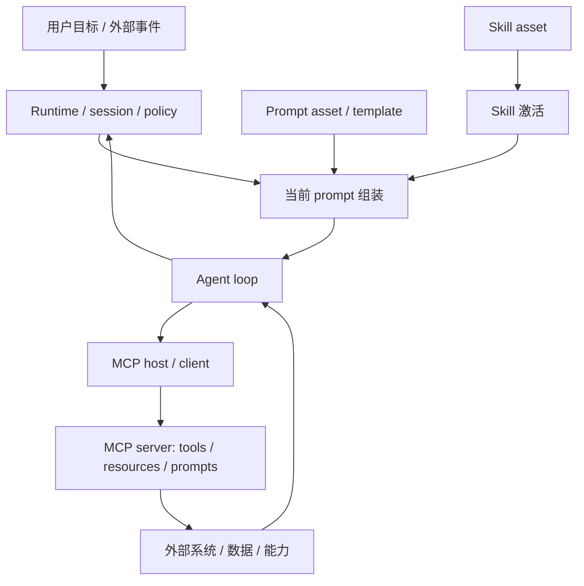

# AI 代理栈分层：Agent、Prompt、Skill 与 MCP 的概念边界

这篇文档是 `docs/ai-systems/` 的合并入口。旧的 `agent.md`、`prompt.md`、`skill.md` 和 `mcp.md` 已并入本文；具体产品运行时不再作为本文的概念锚点。

## 1. 这份文档要帮你学会什么

这篇文档不是 AI 名词表。它要帮你把 `Agent`、`Prompt`、`Skill` 和 `MCP` 压成一张能反复调用的分层地图。

读完后，你应该至少能做到：

- 分清哪些问题属于执行闭环，哪些属于当前输入控制，哪些属于可复用工作方法，哪些属于能力协议。
- 判断一个系统的问题更可能出在 agent loop、prompt stack、skill activation、MCP capability contract，还是 runtime/policy。
- 识别“工具很多但没有 agent”“prompt 很长但没有 skill”“有 MCP 但没有运行时治理”的伪分层。
- 判断什么时候应该继续改 prompt，什么时候该沉淀 skill，什么时候该用 workflow，什么时候该补 runtime/policy。

## 2. 一句话结论 / 问题定义

**Agent 负责目标驱动执行闭环，Prompt 负责当前轮次输入控制面，Skill 负责可复用工作方法资产，MCP 负责把 tools/resources/prompts 标准化接入 AI 应用。**

这组概念真正解决的问题不是“AI 系统里为什么又多出几个名词”，而是：

- 复杂代理系统到底应该怎样拆层。
- 为什么“超长 prompt + 一堆工具”通常撑不起稳定系统。
- 为什么工具协议、行为方法、当前输入和目标执行不能混成一层。

## 3. 四个对象的边界

| 对象 | 它负责什么 | 它不等于什么 | 最容易混淆的边界 |
| --- | --- | --- | --- |
| `Agent` | 围绕目标、状态、动作、反馈和停止条件形成执行闭环 | 模型、聊天助手、单次 tool calling、runtime | 有工具不等于有 agent；能回答不等于能持续完成目标 |
| `Prompt` | 当前轮次真正送进模型的输入控制面 | 任意长文本、用户消息、skill、memory、workflow | current prompt 与 prompt asset 必须分开 |
| `Skill` | 一类任务的 SOP、判断规则、边界、交付物要求和完成标准 | 更长的 prompt、workflow、tool、policy、memory | skill asset 与 activated skill 必须分开 |
| `MCP` | host/client/server 之间标准化交换 tools、resources、prompts 的协议层 | agent framework、工具集合、安全方案、runtime | 能力接入 contract 不等于行为决策 |

最关键的边界句：

- `Agent` 解决“下一步做什么、何时停”。
- `Prompt` 解决“这一轮模型读到什么、如何理解任务”。
- `Skill` 解决“这类任务通常怎么做、怎么收口”。
- `MCP` 解决“外部能力和上下文如何标准接入”。

## 4. 核心结构

最小可用结构不是四个并列名词，而是“输入控制面 + 行为资产层 + 执行闭环 + 能力协议层”。

这张图里：

- `Prompt` 是当前轮次输入的载体。
- `Skill` 是长期存在的行为资产，只有被激活并装入执行过程才生效。
- `Agent` 是读取状态、选择动作、接收反馈、决定是否继续的 loop。
- `MCP` 是能力交换协议，不决定 agent 为什么现在要做某一步。
- `Runtime/policy` 承接会话、权限、审批、日志、回放和生命周期；本文只把它作为相邻层，不展开成独立产品对象。

## 5. Agent：目标驱动执行闭环

Agent 的本质不是会回答问题，而是把目标压成“感知状态、选择动作、执行动作、读取反馈、决定是否继续”的执行闭环。

一个最小 agent 至少有六个面：

- `目标`：系统到底要完成什么，而不是只回答什么。
- `状态`：当前事实、历史动作、未完成项、约束条件和反馈结果。
- `动作面`：可以提问、调用工具、读资源、写外部系统、请求审批或结束。
- `决策面`：决定下一步动作的策略，通常受 current prompt、activated skill、policy 和显式逻辑共同影响。
- `反馈面`：工具结果、用户回复、环境变化、报错、资源读取结果。
- `停止与交接`：何时交付、何时回退、何时必须请求人工接管。

最小链路：

1. 接收目标，并把目标压成当前可操作状态。
2. 基于状态判断下一步动作，而不是一次性把所有动作写死。
3. 调用工具、读取资源、向用户追问，或产出中间结果。
4. 读取执行结果和环境反馈。
5. 更新状态、修正计划，必要时改变下一步策略。
6. 在达到停止条件前持续循环。

常见失败模式：

- 把一次 tool calling 包装成“自主 agent”。
- 目标过大但没有显式拆解，导致循环发散。
- 状态污染或状态过期，导致后续动作建立在错误前提上。
- 没有审批点，导致 agent 在高风险动作前无人把关。
- 没有停止条件，导致反复尝试、反复改写或资源浪费。
- 把 prompt、skill、policy、workflow 的责任全部压进 agent，导致边界失控。

## 6. Prompt：当前轮次输入控制面

Prompt 首先不是“写给模型的一大段话”，而是模型在当前轮次实际读到的输入控制面。在工程系统里，它经常由 system / developer / user / context / tool result / output constraint 叠成一个 prompt stack。

判断一个对象是不是 prompt，不看它像不像提示词，只看它有没有进入当前轮次的模型输入。

| 表达或对象 | 在本文里怎么处理 | 为什么 |
| --- | --- | --- |
| 当前调用里的 system + developer + user + context + output constraint | 当前 prompt stack | 它们已经共同进入模型当前轮次 |
| 单独一条 user message | prompt 的一部分 | 它不能代表全部输入控制面 |
| 还躺在向量库里的知识片段 | 还不是 prompt | 只有被取出并注入当前轮次后，才进入 prompt |
| 工具返回的一段 JSON 报错 | 单独看不是 prompt | 下一轮读入后，它才成为 prompt 的反馈成分 |
| 一个 `SKILL.md` 文件 | 不是 prompt 本体 | 它是行为资产，通常需要被激活并装进当前执行 |
| 一个 MCP prompt 模板 | prompt asset，不是 current prompt | 它描述可复用提示资产，不是已经送入模型的本轮输入 |
| 一个 workflow 图 | 不是 prompt | 它描述执行结构，不是当前轮次文本输入本体 |

常见失败模式：

- 把 prompt 等同于 user message。
- 只要进了上下文窗口，就把指令、背景、反馈和约束混成一层。
- 把 skill 当成更长的 prompt。
- 明明需要状态管理、权限治理、工具协议或 workflow，却继续加长 prompt。
- prompt 失败时直接归因模型能力，而不检查层次、优先级和上下文污染。

## 7. Skill：可复用工作方法资产

Skill 的本质，是把一类任务里的 SOP、判断规则、边界、交付物要求和完成标准，压成可复用、可版本化、可激活的行为资产。

最容易混淆、但必须分开的两层是：

- `skill asset`：磁盘上、仓库里、注册表里长期存在的工作方法资产。
- `activated skill`：这一轮真正被选中，并通过 prompt、agent 配置、workflow 或其他承载形式进入执行过程的 skill。

一个有用的 skill 通常包含：

- `资产入口`：它叫什么、解决哪类任务、什么时候应该触发。
- `方法本体`：问题框架、步骤模板、判断顺序和边界规则。
- `激活合同`：由谁选择它、按什么条件选择、选中后如何加载。
- `承载形式`：prompt、agent 配置、workflow 文件、step 文件、模板或其他外部资产。
- `依赖能力面`：需要哪些工具、资源、运行时支持或上层角色。
- `完成与回归`：什么算做完、怎样自检、怎样靠代表性任务防止退化。

当前仓库里的现实锚点：

- [bmad-agent-tech-writer/SKILL.md](../../.agents/skills/bmad-agent-tech-writer/SKILL.md)：skill 可以承载 agent 角色、菜单和执行规则。
- [bmad-help/SKILL.md](../../.agents/skills/bmad-help/SKILL.md)：skill 可以是路由与工作流入口。
- [bmad-quick-dev/SKILL.md](../../.agents/skills/bmad-quick-dev/SKILL.md)：skill 可以是一组围绕任务类型组织的工作方法包。

常见失败模式：

- 把很多不相干任务硬塞进一个巨型 skill。
- skill 只有口号，没有步骤、边界和完成标准。
- skill 名义上存在，但没有显式激活机制，运行时根本没生效。
- 把 prompt、skill、workflow 的责任混成一层。
- 把权限、密钥、工具契约或审批逻辑直接写进 skill，导致职责错位。
- skill 长期不更新，继续把旧经验套到新环境里。

## 8. MCP：标准能力协议层

MCP 的核心价值不是让模型更聪明，而是把外部能力与上下文接入方式标准化，让 host 可以用统一协议发现、读取、调用和治理能力面。

MCP 的三个角色：

- `Host`：面向用户的 AI 应用，拥有会话、策略、权限和最终执行控制权。
- `Client`：host 内部的协议端点，负责与 server 建立并维持协议会话。
- `Server`：把外部工具、资源或提示资产按 MCP 方式暴露出来的能力提供方。

MCP 的三类原语：

- `Tools`：可执行动作，例如调用命令、写入系统、发请求。
- `Resources`：可读取的上下文或数据对象，例如文档、文件、数据库内容、状态快照。
- `Prompts`：可复用提示资产或模板；它们是协议对象，不是自动进入当前轮次的 prompt 本体。

最关键的职责句：

**Host 负责编排与治理，Server 负责暴露能力，MCP 负责让两者交换时说同一种协议语言。**

常见失败模式：

- 把 MCP 当成完整 agent framework。
- 只暴露大量原始 tools，却没有更高层能力选择或治理。
- 把安全、审批和沙箱问题误以为“接了 MCP 就自然解决了”。
- tools、resources、prompts 的边界不清，导致协议面无法稳定演进。
- 把 `prompt asset` 直接等同于 current prompt。
- 返回结果缺少结构约束，host 仍需大量 ad-hoc 解析。

## 9. 什么时候用哪一层

| 问题形状 | 优先层 | 判断理由 |
| --- | --- | --- |
| 只是这一轮任务没说清、上下文没组织好、输出约束不稳 | Prompt | 问题发生在当前输入控制面 |
| 同类任务反复出现，需要稳定步骤、边界和完成标准 | Skill | 问题已经从一次输入升级为可复用工作方法 |
| 需要根据状态和反馈持续选择下一步 | Agent | 问题需要目标驱动执行闭环 |
| 需要把外部工具、资源或提示资产标准化接入 | MCP | 问题是能力交换 contract，不是行为决策 |
| 步骤高度确定、分支可穷举、执行要求稳定 | Workflow | 不需要 agent 自主决策 |
| 涉及权限、审批、审计、回放、会话和生命周期 | Runtime / policy | 不应塞进 prompt、skill 或 MCP 协议本身 |

当前更稳的方向通常是：

- 把 `Prompt` 严格收敛为当前轮次输入控制面。
- 把 `Skill` 明确当作可复用工作方法资产，而不是更长的提示词。
- 把 `Agent` 只用于确实需要状态推进和动作选择的任务。
- 把 `MCP` 用作标准化能力接入层，而不是拿它代替 runtime 治理。
- 把权限、审批、日志、回放、会话和生命周期留给 runtime/policy。

## 10. 自测题 / 验证入口

1. 为什么 `Agent`、`Prompt`、`Skill` 和 `MCP` 不是同一层概念？
2. 一个“多工具聊天产品”在什么条件下还不能算真正的 agent？
3. 为什么 `MCP prompt asset` 不能直接等同于 current prompt？
4. 为什么 `skill asset` 和 `activated skill` 必须分开理解？
5. 什么情况下继续改 prompt 就够了？什么情况下应该沉淀 skill？
6. 什么情况下更适合 workflow，而不是 agent？
7. 为什么 MCP 不能替代审批、沙箱、租户隔离和审计？

## 11. 迁移与关联模型

理解了这篇文档后，最值得迁移出去的是下面这组判断：

- 这个问题属于当前输入、可复用方法、执行闭环、能力协议，还是运行时治理？
- 这里需要的是 prompt、skill、workflow、MCP，还是 runtime/policy？
- 这里讨论的是资产对象，还是本轮已经生效的执行对象？
- 这里缺的是协议 contract、行为方法、状态 loop，还是权限边界？

## 12. 未解问题与继续深挖

- prompt asset、skill asset 与 workflow asset 的注册、选择和回放，是否值得再抽成统一资产治理文档？
- MCP 在权限、审批、多租户与沙箱治理上的职责，未来会下沉到协议层还是继续主要留在 host/runtime 层？
- 是否需要把 runtime、policy、workflow 与 agent stack 的关系另写成单独文档？

## 13. 参考资料

- [统一概念文档规范：AI 生成、升级、审查与仓库集成](../methodology/document-generation-methodology.md)
- [bmad-agent-tech-writer/SKILL.md](../../.agents/skills/bmad-agent-tech-writer/SKILL.md)
- [bmad-help/SKILL.md](../../.agents/skills/bmad-help/SKILL.md)
- [bmad-quick-dev/SKILL.md](../../.agents/skills/bmad-quick-dev/SKILL.md)
- [MCP Learn: Architecture](https://modelcontextprotocol.io/docs/learn/architecture)
- [MCP Specification 2025-06-18: Architecture](https://modelcontextprotocol.io/specification/2025-06-18/architecture)
- [MCP Specification 2025-06-18: Server Prompts](https://modelcontextprotocol.io/specification/2025-06-18/server/prompts)
