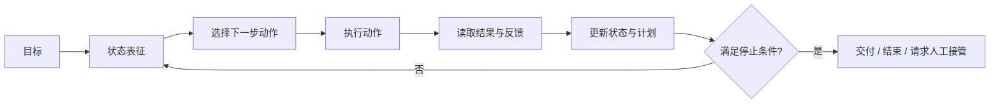
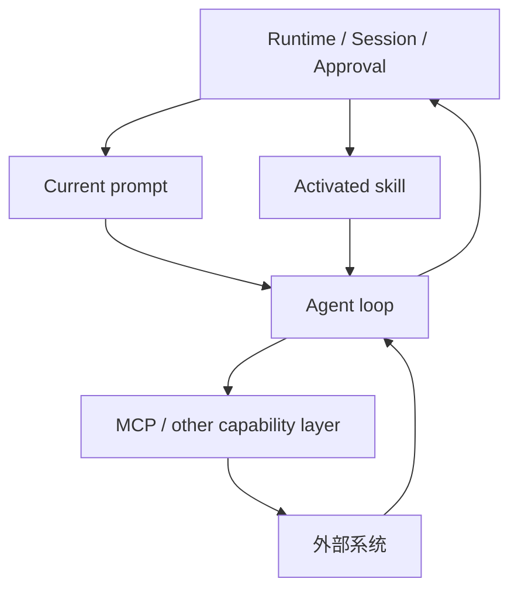

# Agent：目标驱动执行闭环，不是会聊天的模型

## 1. 这份文档要帮你学会什么

这篇文档的重点，不是继续把 `Agent` 写成“会自己做事的 AI”这种口号，而是把它压成一个可判断、可排障的内部模型。

读完后，你应该至少能做到：

- 说清 agent 与模型、workflow、tool calling、runtime 的边界
- 画出一个最小 agent loop
- 判断一个系统缺的是能力面、状态管理、动作选择，还是停止条件
- 识别“只有工具调用，没有真正闭环”的伪 agent

## 2. 一句话结论 / 问题定义

**Agent 的本质，不是会回答问题，而是把目标压成“感知状态、选择动作、执行动作、读取反馈、决定是否继续”的执行闭环。**

这个概念真正解决的问题是：

- 模型怎样从“回答一句话”升级成“持续完成一个目标”
- 系统怎样在不确定环境下连续决定下一步
- 为什么仅有工具调用还不足以构成 agent

## 3. 对象边界与相邻概念

这篇文档里的 `Agent` 边界是：

- 有明确目标或子目标
- 有可更新的状态表征
- 能根据当前状态决定下一步动作
- 能读取执行结果和环境反馈
- 有停止条件、交付条件或人工接管点

它不等于：

- `模型`
  模型是推理引擎；agent 是围绕目标运行的执行闭环。

- `workflow`
  workflow 更偏预先定义的确定性编排；agent 更偏根据状态临时决策。  
  步骤几乎写死时，更像 workflow；分支需要现场判断时，更像 agent。

- `tool calling`
  tool calling 只是动作能力的一部分，不自动包含目标管理、状态更新和停止判断。

- `runtime`
  runtime 承接会话、审批、日志、回放、连接和生命周期；agent 是其中负责“基于状态选下一步动作”的核心执行对象。

- `current prompt`
  prompt 负责当前轮次输入控制；它常常驱动 agent 本轮判断，但 prompt 本身不等于 agent。

- `activated skill`
  skill 提供可复用工作方法；它会影响 agent 的判断顺序和边界，但 skill 本体不等于 agent。

最容易混淆的相邻概念是：

- `assistant`
  可能只是回答型助手，不一定有持续动作闭环。

- `planner`
  可能只负责计划，不负责完整执行。

- `scheduler`
  只负责任务时间与触发，不负责认知判断。

- `policy`
  只规定边界，不等于完整 agent 行为。

## 4. 核心结构

一个最小 agent，至少要同时有下面六个结构面。

- `目标`
  系统到底要完成什么，而不是只回答什么。

- `状态`
  当前已知事实、历史动作、未完成项、约束条件和反馈结果。

- `动作面`
  可以提问、调用工具、读资源、写外部系统、请求审批或结束。

- `决策面`
  决定下一步动作的策略，通常受 current prompt、activated skill、policy 和显式逻辑共同影响。

- `反馈面`
  工具结果、用户回复、环境变化、报错、资源读取结果。

- `停止与交接`
  何时交付、何时回退、何时必须请求人工接管。

最小闭环可以画成：

如果放进更完整的系统里，可以再补一层外部关系：

## 5. 核心机制 / 主链路 / 因果链

### 5.1 单个 agent loop 的最小链路

一个 agent 的主链路，最稳地可以压成下面这 6 步。

1. 接收目标，并把目标压成当前可操作状态。
2. 基于状态判断下一步动作，而不是一次性把所有动作写死。
3. 调用工具、读取资源、向用户追问，或产出中间结果。
4. 读取执行结果和环境反馈。
5. 更新状态、修正计划，必要时改变下一步策略。
6. 在达到停止条件前持续循环。

这条链里最关键的因果点是：

- 没有状态更新，系统会重复犯同一个错误
- 没有动作选择，系统只是被动回答
- 没有停止条件，系统容易无限循环或过度行动

### 5.2 Agent 与 runtime 的关系

agent 最容易被讲糊的地方，是很多人会把它和 runtime 混成一个对象。

更稳的拆法是：

- agent 负责“基于状态决定下一步”
- runtime 负责“让这个 loop 能长期、安全、可观测地跑起来”

截至 `2026-04-08`，OpenClaw 官方文档仍把 `agent runtime` 和 `agent loop` 分开讲。  
这正好能说明：一个成熟系统里，loop 是执行核，runtime 是承接它的运行壳。

## 6. 关键 tradeoff 与失败模式

agent 带来的价值是：面对不确定任务时，系统可以边做边看、边看边改。  
代价是：行为更难预测，权限风险更高，调试更困难。

最常见的 tradeoff 是：

- 让 agent 自主性更高，覆盖面更强，但不可预测性更大
- 把更多逻辑交给 workflow，稳定性更强，但适应变化更差
- 让 agent 动作面更广，完成能力更强，但权限与审计成本更高
- 让状态更丰富，判断可能更稳，但上下文污染和状态漂移风险也更大

最常见的失败模式是：

- 把一次 tool calling 包装成“自主 agent”
- 目标过大但没有显式拆解，导致循环发散
- 状态污染或状态过期，导致后续动作建立在错误前提上
- 没有审批点，导致 agent 在高风险动作前无人把关
- 没有停止条件，导致反复尝试、反复改写或资源浪费
- 把 prompt、skill、policy、workflow 的责任全部压进 agent，导致边界失控

## 7. 应用场景

`Agent` 这个模型最适合分析：

- 编码代理：读仓库、改代码、跑测试、根据结果再修正
- 工单或审批助手：先理解任务，再查系统，再决定下一步
- 运维或故障响应助手：观察告警、取日志、比对现象、收敛原因
- 长期在线个人助理：持续接收事件、维护状态、跨通道执行动作

## 8. 工业 / 现实世界锚点

### 8.1 OpenClaw Agent Runtime

截至 `2026-04-08`，OpenClaw 官方文档仍把 agent runtime 作为独立对象来讲。  
这说明真实产品里，agent 不只是一次模型调用，而是一个被运行时包裹、被会话和系统边界约束的执行对象。

### 8.2 OpenClaw Agent Loop

截至 `2026-04-08`，OpenClaw 官方文档仍把 agent loop 明确当作独立概念。  
这能帮助你看到：agent 的关键不是“模型有多强”，而是系统是否真的形成了“状态 -> 动作 -> 反馈 -> 更新”的闭环。

### 8.3 编码代理工作台

编码代理是最直接的现实锚点。  
它必须在“读代码、改代码、运行、看报错、继续修复”之间循环，否则它只是一个能解释代码的聊天助手。

## 9. 当前推荐实践、过时路径与替代

本节涉及当前实践判断。  
其中外部 runtime 例子以 `2026-04-08` 为时间锚点，整栈边界以当前仓库文档对齐结果为基础。

当前更稳的方向通常是：

- 把 agent 当作“目标 + 状态 + 动作面 + 反馈闭环”的组合，而不是单次模型调用
- 把 current prompt、activated skill、capability layer 和 runtime 明确分层
- 把审批、审计、回放与权限控制放到 runtime 层，而不是隐含在 prompt 里
- 对高度确定的任务优先考虑 workflow，不要为了 agent 而 agent

下面这些路径通常已经不够稳：

- 把 function calling 直接等同于 agent
- 让一个超长 prompt 同时承担计划、状态、策略和权限边界
- 在没有日志、没有审批、没有回放能力的情况下让 agent 自动改写外部系统
- 把本该持久化的状态全压在上下文窗口里，指望模型自己维持一致性

更稳的替代是：

- 对纯问答或检索型任务，优先考虑 assistant，而不是过度设计 agent
- 对确定性很高的任务，优先考虑 workflow，而不是强行上 agent
- 对高风险执行面，先设计 runtime 与审批，再决定 agent 允许做什么
- 对可复用工作方法，优先沉到 [skill.md](./skill.md)；对当前输入控制，优先沉到 [prompt.md](./prompt.md)

## 10. 自测题 / 验证入口

1. 一个会调用终端的聊天程序，为什么仍然可能不是 agent？
2. 如果系统没有停止条件，会出现哪些典型故障？
3. 为什么状态更新比“模型很聪明”更接近 agent 的核心？
4. 什么时候应该用 workflow，而不是 agent？
5. agent 的风险为什么通常不在“答案错了”，而在“动作做了”？
6. runtime 和 agent loop 为什么不该混成同一个概念？

## 11. 迁移与关联模型

理解了 `Agent` 之后，最值得迁移出去的，不是某个术语，而是下面这组判断：

- 这里真的需要状态推进和动作选择吗？
- 这里缺的是当前 prompt、activated skill、capability layer，还是 runtime 治理？
- 这里该用 agent，还是 workflow、assistant、policy 或普通 tool orchestration？

如果你接下来想继续深挖相邻层：

- 想看输入控制层：读 [prompt.md](./prompt.md)
- 想看可复用操作知识：读 [skill.md](./skill.md)
- 想看能力协议层：读 [mcp.md](./mcp.md)
- 想回到整栈关系：读 [agent-mcp-skill-openclaw-concepts.md](./agent-mcp-skill-openclaw-concepts.md)

## 12. 未解问题与继续深挖

- 多 agent 协作究竟更应被看成“一个更大 agent 的内部拆分”，还是独立运行时结构？
- agent 的长期记忆应该更多落在检索上下文层，还是显式状态机与持久状态层？
- agent 的停止条件与人工接管点，是否值得抽成独立设计模板？

## 13. 参考资料

- [AI 代理栈分层：Agent、MCP、Skill、Prompt 与 OpenClaw 的概念边界](./agent-mcp-skill-openclaw-concepts.md)
- [Prompt：从一次性提问到系统指令栈的输入控制面](./prompt.md)
- [Skill：把 SOP、约束与操作策略沉淀成可复用行为资产](./skill.md)
- [MCP：把工具、资源与提示接成标准能力面的协议层](./mcp.md)
- [统一概念文档规范：新建、升级、审查与仓库集成](../methodology/document-generation-methodology.md)
- [OpenClaw: Agent Runtime](https://docs.openclaw.ai/concepts/agent)
- [OpenClaw: Agent Loop](https://docs.openclaw.ai/concepts/agent-loop)
