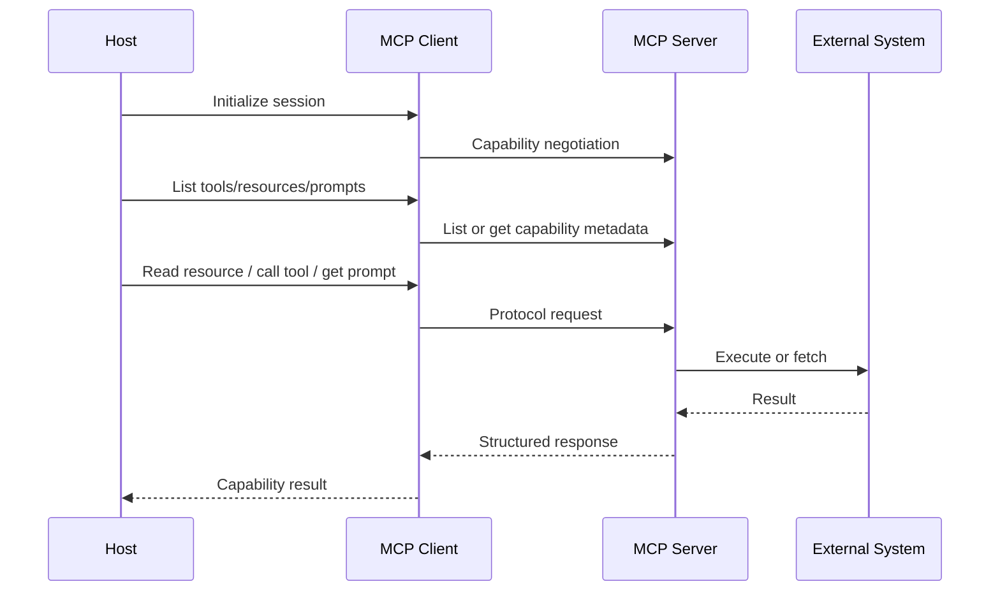

# MCP：把工具、资源与提示接成标准能力面的协议层

## 1. 这份文档要帮你学会什么

这篇文档的重点，不是把 `MCP` 写成“最近很火的新名词”，而是把它还原成一个边界清楚的协议层模型。

读完后，你应该至少能做到：

- 说清 MCP 到底解决什么问题，不解决什么问题
- 分清 host、client、server 各自负责什么
- 区分 tools、resources、prompts 这三类协议原语
- 不再把 MCP 当成 agent framework、工具包合集或安全方案本身

## 2. 一句话结论 / 问题定义

**MCP 的核心价值，不是让模型更聪明，而是把外部能力与上下文接入方式标准化，让 host 可以用统一协议发现、读取、调用和治理能力面。**

它真正解决的问题是：

- 工具、资源和提示资产怎样以统一 contract 接进 AI 应用
- 为什么不能让每个产品都重新发明一套私有 tool schema
- 当能力越来越多时，怎样让接入层保持可替换、可组合、可治理

## 3. 对象边界与相邻概念

这篇文档里的 `MCP` 边界是：

- 它是协议层，不是推理层
- 它关注能力如何被发现、读取、调用和返回
- 它定义 host / client / server 的角色关系
- 它把 tools、resources、prompts 视为协议原语

它不等于：

- `Agent`
  agent 负责目标驱动执行闭环；MCP 负责能力接入 contract。

- `工具集合`
  tools 只是能力对象；MCP 是承载这些对象的统一协议。

- `API gateway`
  gateway 可能承接安全、路由、审批和产品逻辑；MCP 只覆盖其中与能力交换直接相关的协议职责。

- `安全方案`
  MCP 不是审批、沙箱、租户隔离和审计的完整替代品。

- `当前 prompt`
  MCP 里的 `prompts` 说的是协议暴露的 prompt asset；只有被 host 选择、实例化并真正装进本轮输入后，它才会成为 current prompt 的一部分。

最容易混淆的相邻概念是：

- `function calling`
  通常是单家模型厂商的调用格式，不等于跨系统协议。

- `plugin`
  更像某个生态里的能力包，不一定有统一角色模型。

- `adapter`
  可能只是本地转换层，不一定形成可复用协议面。

- `workflow`
  负责确定性步骤编排，不等于能力交换协议。

## 4. 核心结构

MCP 最关键的，不是某个具体 server，而是“谁编排、谁连接、谁暴露能力、能力分几类”这四个问题。

### 4.1 三个角色

- `Host`
  面向用户的 AI 应用，拥有会话、策略、权限和最终执行控制权。

- `Client`
  host 内部的协议端点，负责与 server 建立并维持协议会话。

- `Server`
  把外部工具、资源或提示资产按 MCP 方式暴露出来的能力提供方。

### 4.2 三类原语

- `Tools`
  可执行动作，例如调用命令、写入系统、发请求。

- `Resources`
  可读取的上下文或数据对象，例如文档、文件、数据库内容、状态快照。

- `Prompts`
  可复用提示资产或模板。  
  它们是协议对象，不是自动进入当前轮次的 prompt 本体。

### 4.3 最关键的职责句

**Host 负责编排与治理，Server 负责暴露能力，MCP 负责让两者交换时说同一种协议语言。**

最小交互图可以画成：

## 5. 核心机制 / 主链路 / 因果链

MCP 的主链路，最稳地可以压成下面这 6 步。

1. Host 为每个 server 建立或管理对应的 client 会话。
2. 初始化阶段，双方交换协议版本与能力信息，确定可用原语。
3. Host 通过 client 发现 server 暴露的 tools、resources、prompts。
4. Agent 或上层逻辑根据当前任务，决定是读 resource、调 tool，还是取某个 prompt asset。
5. Client 按协议向 server 发请求，server 与外部系统交互，并把结果转成结构化响应。
6. Host 再把这些结果交还给 agent、prompt 组装层或产品运行时继续使用。

这条链最值得记住的因果点是：

- MCP 解决的是“能力怎样进来”，不是“为什么现在要做这一步”
- 协议层和行为决策必须分层，否则 MCP 很快会被业务逻辑污染
- prompts 作为协议原语，并不意味着它们会自动变成 current prompt；中间仍然需要 host 的选择、实例化和注入

## 6. 关键 tradeoff 与失败模式

MCP 带来的好处是标准化、可替换性和生态复用；代价是要面对协议治理、版本兼容、权限边界和调试复杂度。

最常见的 tradeoff 是：

- 协议越统一，跨系统复用越强，但抽象设计成本越高
- server 切得越细，组合更灵活，但发现、选择和治理成本越高
- host 承担更多治理责任，系统更稳，但实现负担更重
- 让 server 自己隐含太多业务逻辑，短期接入更快，但长期演进更差

最常见的失败模式是：

- 把 MCP 当成完整 agent framework，导致层次混乱
- 只暴露大量原始 tools，却没有更高层能力选择或治理
- 把安全、审批和沙箱问题误以为“接了 MCP 就自然解决了”
- tools、resources、prompts 的边界不清，导致协议面无法稳定演进
- 把 `prompt asset` 直接等同于 current prompt
- 返回结果缺少结构约束，host 仍需大量 ad-hoc 解析

## 7. 应用场景

`MCP` 这个模型最适合分析：

- 编码代理如何接文件系统、终端、浏览器和检索服务
- 企业助手如何接知识库、内部 API、审批系统和数据源
- 多 server 能力生态如何被 host 统一发现和调用
- 产品如何把“能力接入”从“agent 决策”中拆出来

## 8. 工业 / 现实世界锚点

### 8.1 MCP 官方 Learn 架构文档

截至 `2026-04-08`，MCP 官方 Learn 文档仍把 `host`、`client`、`server` 明确拆开。  
这说明 MCP 首先关心的是角色边界和交互结构，而不是某一家产品自己的工具格式。

### 8.2 MCP 架构规范

截至 `2026-04-08`，MCP 官方规范仍把协议架构讲成“host 应用连接多个 server，并通过 client 管理协议交换”。  
这说明 host 才是编排主体，server 不是自动替代 host 的 agent。

### 8.3 MCP Server Prompts 规范

截至 `2026-04-08`，MCP 官方 prompts 规范继续把 prompts 讲成 server 暴露的 prompt template / asset，并强调应由用户控制或显式选择。  
这正是区分 `prompt asset` 与 `current prompt` 的最直接锚点。

### 8.4 编码代理与企业连接器

现实里，无论是编码代理接文件系统 / 终端 / 浏览器，还是企业助手接知识库 / 工单 / 数据库，真正稳定的需求都不是“多接几个工具”，而是“让多个 host 以一致方式发现和使用能力面”。  
这正是 MCP 适合落地的现实场景。

## 9. 当前推荐实践、过时路径与替代

本节涉及当前实践判断，核对日期为 `2026-04-08`。  
结论主要基于 MCP 官方 Learn 文档、架构规范和 server prompts 规范。

当前更稳的方向通常是：

- 把 MCP 视为能力面协议，而不是代理决策系统
- 在 host / runtime 层保留审批、沙箱、审计和租户隔离能力
- 为 tools、resources、prompts 设计清晰边界，而不是全部塞成“工具调用”
- 尽量让返回结果结构化、稳定、可版本化
- 把 prompt asset 的选择和 current prompt 的组装留在 host 侧显式处理

下面这些路径通常已经不够稳：

- 每个产品自己发明一套 tool JSON
- 把业务编排逻辑硬塞进协议层
- 把能力暴露后就默认交给 agent 自由调用，缺少治理点
- 把 MCP prompt asset、tool result 和 current prompt 混成同一种对象

更稳的替代是：

- 如果只是单应用、单模型、极少量能力接入，简单 adapter 可能更轻
- 如果要跨 host、跨 server、跨团队复用能力面，MCP 或等价协议通常更合适
- 如果重点是确定性业务流程，优先用 workflow 管理编排，把 MCP 留在接入层
- 如果问题属于执行闭环、状态推进和动作选择，优先看 [agent.md](./agent.md)，不要把它压回 MCP

## 10. 自测题 / 验证入口

1. 为什么 MCP 不是 agent？
2. 为什么说 tools、resources、prompts 最好不要混成一个大桶？
3. MCP 解决的是“要不要做这一步”，还是“这一步怎么标准接入”？
4. 为什么接了 MCP 以后，安全问题仍然没有自动消失？
5. 为什么 `prompt asset` 不能直接等同于 current prompt？
6. 什么场景下，一个简单 adapter 比 MCP 更合适？

## 11. 迁移与关联模型

理解了 MCP 之后，最值得迁移出去的，不是某个协议名，而是下面这组判断：

- 这个问题属于能力接入，还是属于执行闭环、工作方法或输入控制？
- 这里需要的是协议 contract，还是 workflow / policy / runtime？
- 这里暴露的是 tool、resource、prompt asset，还是已经进入本轮执行的对象？

如果你接下来想继续深挖相邻层：

- 想看执行闭环：读 [agent.md](./agent.md)
- 想看可复用操作知识：读 [skill.md](./skill.md)
- 想看输入控制层：读 [prompt.md](./prompt.md)
- 想回到整栈关系：读 [agent-mcp-skill-openclaw-concepts.md](./agent-mcp-skill-openclaw-concepts.md)

## 12. 未解问题与继续深挖

- prompts 作为协议原语，在大规模生产系统里应如何版本化与审计？
- MCP 将来会不会出现更强的能力分类、权限语义和可发现性标准？
- 当 server 数量很多时，host 应如何做能力选择与负载治理？

## 13. 参考资料

- [AI 代理栈分层：Agent、MCP、Skill、Prompt 与 OpenClaw 的概念边界](./agent-mcp-skill-openclaw-concepts.md)
- [Agent：目标驱动执行闭环，不是会聊天的模型](./agent.md)
- [Skill：把 SOP、约束与操作策略沉淀成可复用行为资产](./skill.md)
- [Prompt：从一次性提问到系统指令栈的输入控制面](./prompt.md)
- [统一概念文档规范：新建、升级、审查与仓库集成](../methodology/document-generation-methodology.md)
- [MCP Learn: Architecture](https://modelcontextprotocol.io/docs/learn/architecture)
- [MCP Specification 2025-06-18: Architecture](https://modelcontextprotocol.io/specification/2025-06-18/architecture)
- [MCP Specification 2025-06-18: Server Prompts](https://modelcontextprotocol.io/specification/2025-06-18/server/prompts)
