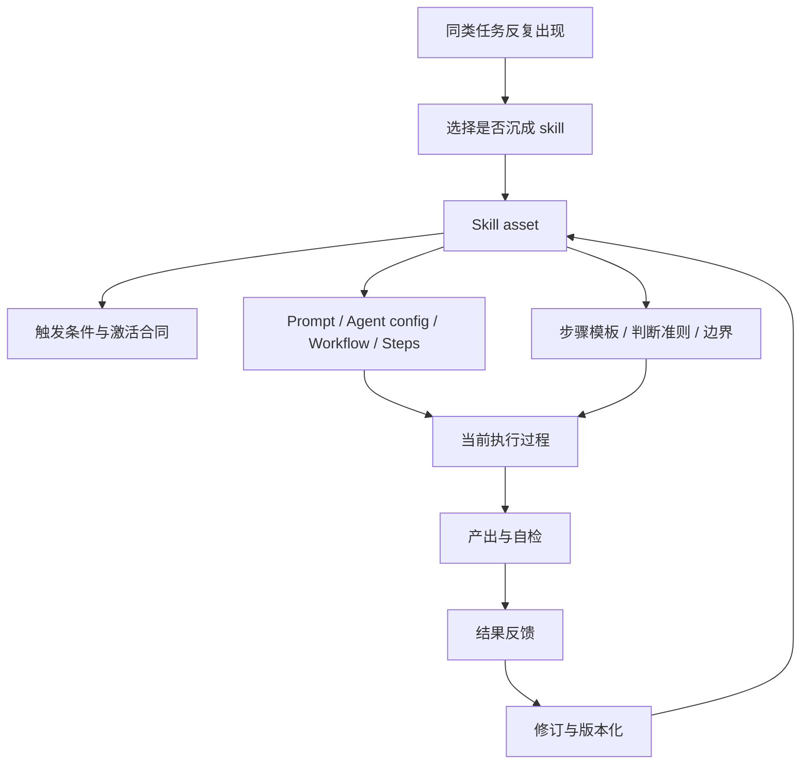

# Skill：把 SOP、约束与操作策略沉淀成可复用行为资产

## 1. 这份文档要帮你学会什么

这篇文档的重点，不是把 skill 继续写成“更长的 prompt”，而是把它作为一种行为资产讲清。

读完后，你应该至少能做到：

- 分清 skill 到底是资产本体，还是这一轮被激活后的执行指导
- 区分 skill、prompt、workflow、tool、policy 和 memory 的边界
- 判断什么样的经验值得沉成 skill，什么样的问题不该继续压给 skill
- 看懂一个 skill 为什么能跨任务复用，以及它为什么仍然需要激活机制和回归维护

## 2. 一句话结论 / 问题定义

**Skill 的本质，是把一类任务里的 SOP、判断规则、边界、交付物要求和完成标准，压成可复用、可版本化、可激活的行为资产。**

如果只记一句最稳的话：

**讨论 skill 时，先问“这是长期存在的工作方法资产”，再问“它本轮是通过什么承载形式进入执行过程的”。**

## 3. 对象边界与相邻概念

这篇文档里的 `Skill` 边界是：

- 它针对的是“一类任务通常应该怎么做”
- 它可以跨多次任务复用，而不是只服务某一轮输入
- 它通常包含触发条件、步骤模板、判断准则、边界和完成标准
- 它往往需要通过某种激活机制，才会在当前执行里生效
- 它会改变 agent 的工作方式，但不直接等于能力协议、权限系统或模型参数

它不等于：

- `Prompt`：prompt 是当前轮次的输入控制面；skill 是长期存在的行为资产。skill 常常通过 prompt 生效，但 skill 本体不等于当前 prompt。
- `Workflow`：workflow 更偏确定性步骤编排；skill 更偏在一类任务里如何判断、如何收口。步骤几乎写死时，更像 workflow；仍需大量现场判断时，更像 skill。
- `Tool`：tool 决定“能做什么动作”；skill 决定“面对这类任务通常怎么做”。
- `Policy`：policy 决定哪些事不能做、哪些边界不能越；skill 除了边界，还包含方法、顺序和完成标准。
- `Memory`：memory 保存或检索状态；skill 保存的是可复用工作方法，不是事实存储。
- `Fine-tuning`：fine-tuning 改模型参数；skill 改外部行为资产。

最容易混淆、但必须分开的两层是：

- `skill asset`：磁盘上、仓库里、注册表里长期存在的工作方法资产
- `activated skill`：这一轮真正被选中，并通过 prompt、agent 配置、workflow 或其他承载形式进入执行过程的 skill

## 4. 核心结构

一个有用的 skill，通常至少包含下面六个结构面。

- `资产入口`
  它叫什么、解决哪类任务、什么时候应该触发。

- `方法本体`
  它教的不是一句话，而是问题框架、步骤模板、判断顺序和边界规则。

- `激活合同`
  由谁选择它、按什么条件选择、选中后如何加载到当前执行过程。

- `承载形式`
  skill 可能通过 prompt、agent 配置、workflow 文件、step 文件、模板或其他外部资产落地；承载形式不是 skill 本体，但决定它如何生效。

- `依赖能力面`
  skill 需要哪些工具、资源、运行时支持或上层角色，但它本身不替代这些能力面。

- `完成与回归`
  skill 不只要说明“怎么做”，还要说明“什么算做完”“怎样自检”“怎样靠代表性任务防止退化”。

可以把它压成下面这张图：

## 5. 核心机制 / 主链路 / 因果链

skill 最容易被讲糊的地方，在于它其实同时存在于两个时间尺度上。

### 5.1 设计时链路：从经验到资产

设计时最常见的链路是：

1. 某类任务反复出现，而且每次都不是完全从零开始
2. 团队发现其中存在稳定的问题框架、步骤顺序、边界和交付标准
3. 这些稳定部分被抽出来，写成 `SKILL.md`、workflow、step 文件、模板或其他组合资产
4. skill 被赋予触发条件、适用范围和完成标准
5. 后续再用代表性任务持续回归，避免 skill 逐渐失真

这条链说明：

- skill 不是想到什么就记什么
- 只有能复用、能迁移、能收口的经验，才值得沉成 skill
- 如果没有回归维护，skill 很快会从“稳定资产”退化成“过时口号”

### 5.2 运行时链路：从资产到生效

运行时最常见的链路是：

1. 系统或人工识别当前任务是否落在某类已知工作模式里
2. 选择器、上层 agent、路由逻辑或人工决定启用某个 skill
3. skill 的一部分内容通过 prompt、agent 配置、workflow 或 step 文件进入当前执行
4. agent 依照 skill 提供的问题框架、步骤顺序和边界去做事
5. 产出在完成标准和自检规则下收口
6. 执行结果反过来暴露 skill 的缺口，推动下一轮修订

这条链说明：

- skill 本体和它的承载形式不是一回事
- skill 的价值不在“更长”，而在“当前执行不用再完全从零组织方法”
- 如果没有激活合同，skill 就只是仓库里的静态文本

## 6. 关键 tradeoff 与失败模式

skill 买到的是复用、迁移和行为稳定；代价是需要额外维护作用域、激活边界和版本回归。

最常见的 tradeoff 是：

- 颗粒度太粗，复用范围看起来更大，但实际谁都用不好
- 颗粒度太细，组合弹性更强，但选择和维护成本会上升
- 边界写得太松，触发率高但误用多
- 边界写得太死，误用少但真正该用时也不触发

最常见的失败模式是：

- 把很多不相干任务硬塞进一个巨型 skill
- skill 只有口号，没有步骤、边界和完成标准
- skill 名义上存在，但没有显式激活机制，运行时根本没生效
- 把 prompt、skill、workflow 的责任混成一层，最后谁也说不清
- 把权限、密钥、工具契约或审批逻辑直接写进 skill，导致职责错位
- skill 长期不更新，继续把旧经验套到新环境里
- 只写激活入口，不写承载资产和回归规则，最后变成“调用了一个名字”，却没有稳定工作方法

## 7. 应用场景

`Skill` 这个模型最适合分析：

- 编码代理里的代码审查、文档升级、故障定位等专门工作模式
- 企业助手里的工单分诊、审批建议、知识整理等 SOP 密集任务
- 领域助手里的诊断框架、报告生成框架和检查清单
- 多 agent 系统里，不同角色如何获得不同工作方法

## 8. 工业 / 现实世界锚点

### 8.1 `bmad-tech-writer`：skill 作为激活入口

[bmad-tech-writer/SKILL.md](../../.agents/skills/bmad-tech-writer/SKILL.md) 本身很薄，但它会把执行权切到 [tech-writer.md](../../_bmad/bmm/agents/tech-writer/tech-writer.md)。  
这说明一个 skill 可以主要承担“触发与加载”的责任，而把更细的 persona、菜单和执行规则放到下级资产中。

### 8.2 `bmad-help`：skill 作为路由与工作流入口

[bmad-help/SKILL.md](../../.agents/skills/bmad-help/SKILL.md) 会继续转到 [workflow.md](../../.agents/skills/bmad-help/workflow.md)。  
这说明 skill 不一定直接长成一大段提示词，它也可以是“把你带进正确流程”的入口层资产。

### 8.3 `bmad-quick-dev-new-preview`：skill 作为完整工作方法包

[bmad-quick-dev-new-preview/SKILL.md](../../.agents/skills/bmad-quick-dev-new-preview/SKILL.md) 会进一步加载 [workflow.md](../../.agents/skills/bmad-quick-dev-new-preview/workflow.md)，而 workflow 又继续调 step 文件。  
这说明一个成熟 skill 往往不是单文件，而是一组围绕任务类型组织起来的工作方法包。

这三个锚点合在一起，足够说明：

- skill 可以很薄，也可以很厚
- skill 可以偏激活入口，也可以偏完整工作方法
- skill 的关键不在文件长短，而在它是否稳定承载一类任务的做事方式

## 9. 当前推荐实践、过时路径与替代

本节涉及当前实践判断，时间锚点为 `2026-04-08`，主要依据当前仓库中的 skill 资产与调用方式观察。

当前更稳的方向通常是：

- 让 skill 聚焦一类清晰任务，而不是包打天下
- 给 skill 明确触发条件、激活合同、边界和完成标准
- 把 skill 写成可维护资产组，而不是只写一段长提示词
- 让 skill 依赖的能力面、运行时和审批层保持分责
- 用代表性任务持续回归，验证 skill 是否真的提升稳定性

下面这些路径通常已经不够稳：

- 把 skill 理解成“更长的 prompt”
- 只保留一个 skill 名称，不说明它什么时候该用、怎样生效
- 把 workflow、policy、tool contract 和 skill 全塞成一个单体文档
- 让 skill 直接承担权限、安全、审批和运行时责任
- 不做回归维护，默认旧 skill 能一直适配新环境

更稳的替代是：

- 如果只是一次性任务说明，普通 [prompt.md](./prompt.md) 往往已经足够
- 如果步骤高度固定、确定性很强，优先考虑 workflow 或显式程序逻辑
- 如果问题属于能力接入和上下文协议，优先看 [mcp.md](./mcp.md)
- 如果问题属于执行闭环和状态推进，优先看 [agent.md](./agent.md)
- 如果问题属于权限、审计和生命周期治理，优先交给 runtime / policy 层

## 10. 自测题 / 验证入口

1. 为什么 skill 不是“更长的 prompt”？
2. 为什么 skill 必须区分“资产本体”和“运行时承载形式”？
3. 什么情况下，一个经验值得从 prompt 升级为 skill？
4. 为什么没有激活合同的 skill，通常只是仓库里的静态文本？
5. 什么时候应该用 workflow，而不是 skill？
6. 一个 skill 如果没有完成标准和代表性回归，会出现什么问题？

## 11. 迁移与关联模型

理解了 `Skill` 之后，最值得迁移出去的不是某个术语，而是下面这组判断：

- 这是一次性输入控制问题，还是长期工作方法资产问题？
- 这是该写成 skill，还是该写成 workflow、policy、tool contract 或 memory？
- 这个 skill 的核心价值是方法本体、激活入口，还是完整资产包？

最值得连着看的文档是：

- [Prompt：从一次性提问到系统指令栈的输入控制面](./prompt.md)
- [Agent：目标驱动执行闭环，不是会聊天的模型](./agent.md)
- [MCP：把工具、资源与提示接成标准能力面的协议层](./mcp.md)
- [AI 代理栈分层：Agent、MCP、Skill、Prompt 与 OpenClaw 的概念边界](./agent-mcp-skill-openclaw-concepts.md)

最值得保留的迁移句是：

**Skill 负责沉淀“这类任务通常怎么做”；一旦问题转向当前轮次输入、确定性编排、能力接入或运行时治理，就应该及时切到 prompt、workflow、MCP 或 runtime 等更合适的层。**

## 12. 未解问题与继续深挖

- skill 的最佳粒度，应该按任务类型划，还是按认知模式与交付物类型共同划？
- skill 的回归测试与验收，更接近提示测试、工作流验收，还是软件回归测试？
- skill 的激活边界，未来是否值得单独抽成“skill activation contract”文档？

## 13. 参考资料

- [AI 代理栈分层：Agent、MCP、Skill、Prompt 与 OpenClaw 的概念边界](./agent-mcp-skill-openclaw-concepts.md)
- [Prompt：从一次性提问到系统指令栈的输入控制面](./prompt.md)
- [Agent：目标驱动执行闭环，不是会聊天的模型](./agent.md)
- [MCP：把工具、资源与提示接成标准能力面的协议层](./mcp.md)
- [统一概念文档规范：新建、升级、审查与仓库集成](../methodology/document-generation-methodology.md)
- [bmad-tech-writer/SKILL.md](../../.agents/skills/bmad-tech-writer/SKILL.md)
- [tech-writer.md](../../_bmad/bmm/agents/tech-writer/tech-writer.md)
- [bmad-help/SKILL.md](../../.agents/skills/bmad-help/SKILL.md)
- [bmad-help/workflow.md](../../.agents/skills/bmad-help/workflow.md)
- [bmad-quick-dev-new-preview/SKILL.md](../../.agents/skills/bmad-quick-dev-new-preview/SKILL.md)
- [bmad-quick-dev-new-preview/workflow.md](../../.agents/skills/bmad-quick-dev-new-preview/workflow.md)
