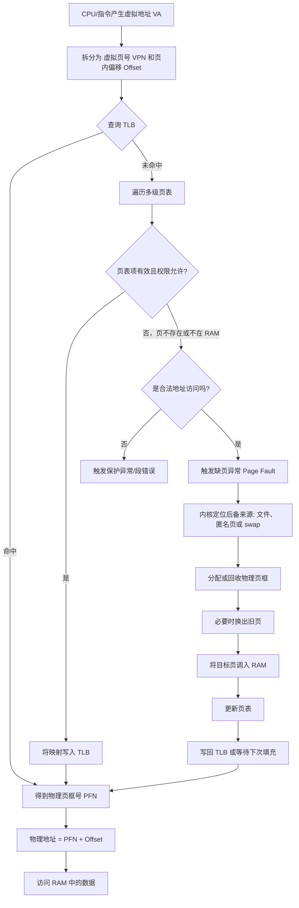

# 虚拟内存：按“学习建模”方式理解的完整说明

## 1. 文档目的

这份文档不是把“虚拟内存”当作一个术语解释，而是按 `learning-new-things-playbook.md` 与 `cognitive-modeling-playbook.md` 的方法，把它重建成一个可操作的内部模型。

目标不是“看过定义”，而是达到以下结果：

- 能解释虚拟内存是什么
- 能说明它为什么会被设计出来
- 能讲清它如何运转
- 能判断它和物理内存、缓存、交换空间之间的关系
- 能预测常见现象，例如缺页、TLB miss、内存抖动
- 能把它应用到程序性能分析、系统理解与故障定位中

一句话先给结论：

**虚拟内存是一层地址抽象与访问控制机制。它让每个进程看到的是自己的连续地址空间，而不是直接操作真实的物理内存；硬件与操作系统共同负责把虚拟地址映射到物理页框，并在必要时把不活跃的数据放到磁盘或文件后备存储中。**

---

## 2. 学习目标与问题定义

### 2.1 学习目标

如果学习目标只是“能背定义”，那知道“虚拟内存是逻辑地址到物理地址的映射”就结束了。  
但如果目标是形成可应用模型，那么至少要能回答：

- 为什么操作系统不让程序直接用物理地址
- 为什么一个进程会觉得自己有一大片连续内存
- 为什么程序访问一个变量时，有时会很快，有时会突然很慢
- 为什么内存不够时系统还能暂时运行，但性能可能急剧下降
- 为什么 `fork`、`mmap`、共享库、文件映射都和虚拟内存强相关

### 2.2 要解决的核心问题

从第一性原理看，计算机必须同时满足几件事：

- 让程序容易使用内存
- 让多个程序彼此隔离，不能随意破坏对方
- 在物理内存有限时，仍尽量运行更多程序
- 让常用数据尽量留在更快的存储层次中
- 让代码、数据、文件、设备等资源能被统一管理

虚拟内存就是围绕这些目标形成的系统级解决方案。

---

## 3. 对象边界

按 playbook 的方法，先划定边界，否则容易把不同概念混在一起。

### 3.1 虚拟内存“管什么”

虚拟内存主要处理：

- 进程看到的地址空间如何定义
- 虚拟地址如何翻译成物理地址
- 哪些地址可读、可写、可执行
- 内存页何时驻留在 RAM，何时不在
- 缺页时如何补页
- 不同进程之间哪些页隔离，哪些页共享

### 3.2 虚拟内存“不直接管什么”

它不等于：

- CPU 缓存
- 应用层内存分配器本身
- 磁盘文件系统本身
- 交换分区本身

但它和这些对象有强关联：

- 和 CPU 缓存有关，因为地址翻译与访问速度会影响缓存行为
- 和内存分配器有关，因为 `malloc` 最终要向操作系统申请虚拟地址区间
- 和文件系统有关，因为 `mmap` 可以把文件映射进虚拟地址空间
- 和交换空间有关，因为页面可以被换出到磁盘

### 3.3 系统边界内的主要角色

- 进程：提出内存访问请求
- CPU/MMU：执行地址翻译和权限检查
- TLB：缓存最近的地址翻译结果
- 页表：保存虚拟页到物理页框的映射
- 操作系统内核：创建地址空间、维护页表、处理缺页异常
- 物理内存：实际承载页面内容
- 磁盘/文件：作为页面的后备存储

---

## 4. 核心结构：虚拟内存由什么组成

如果只记定义而不记结构，理解会很快散掉。虚拟内存至少可以拆成以下部件。

### 4.1 虚拟地址空间

每个进程通常拥有自己的虚拟地址空间。对进程来说，它看到的是一段从低地址到高地址的“连续空间”。

这段空间里通常会有：

- 代码段
- 全局/静态数据段
- 堆
- 内存映射区
- 栈
- 内核保留区或受保护区域

注意：这里的“连续”通常是逻辑上的连续，不代表它在物理内存里也连续。

### 4.2 页与页框

虚拟内存通常按固定大小的块管理，常见单位是页（page）。

- 虚拟空间里的块叫页
- 物理内存里的块叫页框（page frame）

典型页大小常见为 `4 KB`，也可能有大页，如 `2 MB`、`1 GB`。  
固定大小的好处是：

- 便于映射
- 便于权限控制
- 便于换入换出
- 避免外部碎片过于严重

### 4.3 页表

页表保存“虚拟页 -> 物理页框”的映射关系，以及一些状态位，例如：

- present：当前页是否在物理内存中
- read/write/execute：权限
- user/supervisor：用户态还是内核态可访问
- accessed：是否被访问过
- dirty：是否被修改过

现代系统通常使用多级页表，而不是一张巨大单表。原因很直接：

- 虚拟地址空间很大
- 稀疏地址空间很常见
- 单级页表会浪费大量内存

### 4.4 MMU

MMU（Memory Management Unit）是 CPU 中负责地址翻译与权限检查的硬件单元。  
程序发出的是虚拟地址，MMU 负责根据页表把它转换为物理地址。

### 4.5 TLB

TLB（Translation Lookaside Buffer）是页表项的高速缓存。  
如果每次访存都要多级查页表，代价太高，所以硬件会缓存最近使用过的翻译结果。

因此一次内存访问，现实里往往不是“直接读内存”，而是：

1. 查 TLB
2. 如果命中，快速得到物理地址
3. 如果未命中，再查页表
4. 如果页表显示页面不在内存，触发缺页异常

### 4.6 缺页异常

当进程访问的虚拟页当前没有对应的可用物理页框时，会触发 page fault。  
这不一定代表错误，有两种常见情况：

- 合法缺页：页面只是还没装入 RAM，需要内核补页
- 非法缺页：访问越界或权限不允许，进程会收到异常，例如段错误

### 4.7 后备存储

一个页即使不在 RAM 中，也可能有“后备来源”：

- 可执行文件
- 共享库文件
- 内存映射文件
- swap 分区或 swap 文件
- 按需分配的零页

这说明一个关键事实：

**虚拟内存不要求所有已分配地址都同时驻留在物理内存中。**

---

## 5. 主链路：一次内存访问到底发生了什么

这是理解虚拟内存最重要的主链路。

### 5.1 正常访问路径

假设程序要读取某个变量：

1. 指令给出一个虚拟地址
2. CPU 把虚拟地址拆成“虚拟页号 + 页内偏移”
3. MMU 先查询 TLB
4. 若 TLB 命中，得到物理页框号
5. 物理页框号与页内偏移组合成物理地址
6. CPU 访问对应物理内存

这条路径快，前提是：

- 页表映射有效
- 权限允许
- 页面已经在 RAM 中
- TLB 尽量命中

### 5.2 TLB 未命中路径

如果 TLB 未命中：

1. 硬件或硬件加软件遍历页表
2. 找到对应页表项
3. 检查权限与状态位
4. 将翻译结果填入 TLB
5. 继续执行访存

此时会比 TLB 命中慢，但通常仍远快于缺页。

### 5.3 缺页路径

如果页表显示该页不在 RAM：

1. CPU 触发缺页异常，陷入内核
2. 内核判断这是合法访问还是非法访问
3. 若合法，内核找到该页的后备来源
4. 分配或回收一个物理页框
5. 必要时把旧页换出
6. 把所需页面从文件或 swap 读入 RAM
7. 更新页表
8. 重新执行刚才失败的指令

这条路径可能慢几个数量级，因为它可能涉及磁盘 I/O。

### 5.4 虚拟地址到物理地址转换流程图

这张图可以压缩成一句话：

**先查 TLB，未命中再查页表；页在内存就完成翻译，页不在内存就陷入内核补页，非法访问则直接异常。**

---

## 6. 机制层：虚拟内存为什么能工作

按学习手册的要求，不能停在“它会映射”这种表述，必须写清因果链。

### 6.1 地址抽象机制

程序并不直接操作物理内存，而是操作虚拟地址。  
这样做带来两个直接好处：

- 程序不必知道自己被装到哪块物理内存
- 同一程序在不同运行时都能看到稳定的地址空间结构

这使得程序加载、重定位、隔离和共享都更容易实现。

### 6.2 分页机制

把内存切成固定大小的页后，系统就可以：

- 把连续虚拟空间映射到不连续物理内存
- 只把正在使用的页装入 RAM
- 对单页设置权限
- 精细地回收和替换页面

分页本质上是在“连续的使用体验”和“离散的物理管理”之间建立桥梁。

### 6.3 惰性装载机制

很多页在分配后并不会立刻访问。  
如果申请了大块内存就立即全部分配物理页框，会浪费资源。

因此常见做法是：

- 先只建立虚拟地址区间
- 真正访问时再触发缺页并分配页面

这就是 demand paging（按需分页）。

### 6.4 保护机制

页表项中带有权限位，所以 MMU 在翻译地址时不只是“找地址”，还会同时检查：

- 当前模式是否允许访问
- 是读、写还是执行
- 是否越过合法边界

因此虚拟内存同时也是安全与隔离机制的一部分。

### 6.5 共享机制

不同虚拟页可以映射到同一物理页框。这样可以实现：

- 多进程共享同一份只读代码段
- 共享库映射
- 共享内存 IPC
- `fork` 后的写时复制（Copy-On-Write）

这说明虚拟内存不只是“扩容”，也是“共享与隔离并存”的结构。

---

## 7. 第一性原理视角：为什么必须有虚拟内存

把问题拆到底层约束，可以更稳地理解它。

### 7.1 底层事实

- 物理内存容量有限
- 多个进程需要同时运行
- 进程之间必须隔离
- 程序希望看到稳定、简单的地址模型
- 存储层次速度差异极大：寄存器 > 缓存 > RAM > 磁盘

### 7.2 硬约束

- 不能让任意进程直接修改别的进程内存
- 不能要求程序自己管理复杂的物理地址布局
- 不能假设所有已申请内存都会被同时使用
- 不能让每次内存管理都靠纯软件手工解释，代价太高

### 7.3 必要条件

如果要同时满足“易用、隔离、复用、扩展”，至少需要：

- 一层地址抽象
- 一套硬件支持的快速翻译机制
- 一种可以部分驻留、部分换出的块化管理方式
- 一套异常处理路径来处理未命中与缺页

分页加页表加 MMU，正好满足这些必要条件。

### 7.4 它优化了什么

虚拟内存优先优化的是：

- 编程模型的简单性
- 进程隔离
- 物理内存利用率
- 共享与映射的灵活性

### 7.5 它牺牲了什么

它也带来明显代价：

- 地址翻译开销
- 页表占用内存
- 缺页处理复杂度
- 页面替换可能导致性能波动
- 极端情况下会发生抖动（thrashing）

---

## 8. 系统思维视角：把虚拟内存看成一个动态系统

如果只把虚拟内存理解成“地址映射表”，会漏掉动态行为。  
它其实是一个持续运行的系统。

### 8.1 关键存量

- 进程地址空间大小
- 当前驻留在 RAM 中的页集合
- 空闲页框数量
- TLB 中的有效翻译项
- 被修改但尚未回写的脏页数量

### 8.2 关键流量

- 页分配速率
- 页回收速率
- page-in 速率
- page-out 速率
- TLB 填充与失效率

### 8.3 关键反馈回路

#### 回路 A：局部性增强回路

程序访问模式越有局部性：

- 同一批页被反复访问
- TLB 命中率更高
- 缺页率更低
- CPU 等待更少
- 程序执行更快

#### 回路 B：内存压力恶化回路

内存压力上升时：

- 可用页框减少
- 页面更容易被换出
- 缺页增多
- 磁盘 I/O 增多
- 程序推进变慢
- 活跃工作集更难稳定驻留
- 缺页继续增多

这就是抖动出现的结构基础。

### 8.4 延迟

虚拟内存里存在明显延迟：

- 一次错误的内存访问模式，短时间可能还能运行
- 但当工作集超过可用 RAM，延迟积累后会突然性能坍塌

所以“系统还能跑”不等于“内存策略健康”。

### 8.5 杠杆点

如果要优化虚拟内存相关性能，通常高杠杆动作不是“盲目加代码”，而是：

- 改善访问局部性
- 降低工作集大小
- 减少随机大范围扫描
- 调整页面大小或使用 huge pages
- 优化数据结构布局
- 控制并发进程带来的总体内存压力

---

## 9. 一个具体例子：虚拟地址如何翻译

用一个简化例子说明。

假设：

- 页大小是 `4 KB`
- 某个虚拟地址是 `0x12345ABC`

因为 `4 KB = 2^12`，所以：

- 低 `12` 位是页内偏移
- 剩余高位是虚拟页号

于是翻译过程是：

1. 取出虚拟页号
2. 用虚拟页号去查页表
3. 若页表项指向物理页框 `PFN`
4. 最终物理地址 = `PFN << 12` + 页内偏移

这说明一个关键点：

**页内偏移在翻译前后通常不变，真正变化的是“页号到页框号”的映射。**

这也是分页机制高效的原因之一。

---

## 10. 常见关键概念之间的关系

### 10.1 虚拟内存 vs 物理内存

- 虚拟内存是进程看到的地址空间和管理机制
- 物理内存是真实的 RAM 芯片容量

虚拟内存可以大于物理内存，因为不是所有虚拟页都必须同时在 RAM 中。

### 10.2 虚拟内存 vs swap

- 虚拟内存是整个机制
- swap 只是其中一种后备存储

把两者画等号是很常见的误解。

### 10.3 虚拟内存 vs cache

- cache 解决的是“速度层次差异”
- 虚拟内存解决的是“地址抽象、隔离、部分驻留、共享与保护”

两者都利用局部性，但目标不完全相同。

### 10.4 页表 vs TLB

- 页表是正式映射数据结构
- TLB 是页表映射的高速缓存

TLB 小而快，页表大而完整。

---

## 11. 高价值场景：虚拟内存在哪里真正发挥作用

### 11.1 进程隔离

每个进程拥有自己的虚拟地址空间，所以一个普通进程不能直接读写另一个进程的地址。

### 11.2 程序装载与重定位

程序不必绑定到固定物理地址，操作系统可以把它放到任意合适位置。

### 11.3 按需加载

可执行文件、共享库、文件映射页不必一次性全部读入 RAM，而是访问到时再载入。

### 11.4 共享

同一份只读代码页可以被多个进程共享，降低总体内存占用。

### 11.5 写时复制

`fork` 时父子进程先共享同一组物理页，只有一方写入时才复制，显著减少创建进程的成本。

### 11.6 内存映射文件

文件可以像内存一样访问，这让文件 I/O 与内存访问在接口层面统一起来。

---

## 12. 常见失败模式与性能问题

按学习手册，理解一个对象必须知道它怎么失效。

### 12.1 TLB miss 过多

后果：

- 地址翻译成本上升
- CPU 有更多额外开销

常见诱因：

- 工作集过大
- 访问模式分散
- 页粒度不合适

### 12.2 缺页频繁

后果：

- 需要陷入内核
- 可能触发磁盘 I/O
- 延迟急剧上升

常见诱因：

- 首次访问按需分配区域
- 可用 RAM 不足
- 大量 mmap 文件页被频繁访问

### 12.3 抖动（thrashing）

现象：

- CPU 利用率下降
- 磁盘忙于换页
- 系统似乎“活着”，但几乎不推进有效工作

本质：

- 活跃工作集明显超过可用物理内存
- 页面刚换入又被换出，系统主要在做页面搬运

### 12.4 内存碎片与页表开销

分页减少了外部碎片问题，但仍有：

- 页内碎片
- 大量页表占用内存
- 多级页表遍历成本

### 12.5 非法访问

比如：

- 访问空指针
- 写只读页
- 栈溢出越界

这类问题通常会变成保护异常，而不是“悄悄写错地方”。

---

## 13. 常见误区

### 13.1 误区一：虚拟内存就是磁盘当内存

不对。  
这只是虚拟内存的一部分表现。更本质的是：

- 地址抽象
- 隔离
- 映射
- 保护
- 共享

### 13.2 误区二：程序申请了多少内存，就立刻占用多少物理内存

不对。  
申请的是虚拟地址区间，是否真正占用物理页框，要看是否访问、是否提交、是否驻留。

### 13.3 误区三：虚拟地址一定连续，对应物理地址也连续

不对。  
虚拟页完全可以映射到离散的物理页框。

### 13.4 误区四：缺页一定是程序出错

不对。  
合法缺页是虚拟内存正常工作的一部分；非法缺页才是错误。

### 13.5 误区五：只要有 swap，内存就等于变大了

表面上地址可承载更多内容，但性能层面不能等价。  
RAM 与磁盘速度差距太大，重度依赖 swap 往往意味着性能灾难。

---

## 14. 如何用“是否学会”来检验自己

如果你真的理解了虚拟内存，至少应该能回答下面这些问题。

### 14.1 解释测试

- 为什么一个进程觉得自己有连续地址空间，但物理内存未必连续？
- 为什么虚拟内存既提高了安全性，也提高了灵活性？

### 14.2 预测测试

- 如果一个程序随机访问远大于 RAM 的数据集，会发生什么？
- 如果访问模式高度局部化，TLB 和缺页行为会怎样变化？

### 14.3 纠错测试

- “虚拟内存就是 swap”这句话错在哪里？
- “申请 1 GB 内存就一定马上占用 1 GB RAM”这句话错在哪里？

### 14.4 迁移测试

- 为什么数据库、浏览器、虚拟机、编译器这些程序往往特别关心内存局部性？
- 为什么 `mmap` 能把文件 I/O 问题部分转化为虚拟内存管理问题？

---

## 15. 面向实践的最小应用模型

如果你在实际系统里看到以下现象，可以立刻调用虚拟内存模型来分析：

### 15.1 程序突然变慢

先问：

- 是 CPU 算不动，还是频繁缺页？
- 是 TLB miss 上升，还是工作集超过了 RAM？
- 是正常按需分页，还是已经进入抖动？

### 15.2 内存占用看起来很大

先区分：

- 虚拟地址空间大小
- 常驻集大小（RSS）
- 共享页
- 文件映射页
- 匿名页
- swap 使用量

### 15.3 `fork` 很快但后续变慢

先想到：

- 初始阶段可能靠 COW 很省
- 一旦父子进程大量写入，共享页会被复制，真实内存压力才会上来

---

## 16. 一页式总结

### 16.1 最小定义

虚拟内存是一种让进程通过虚拟地址访问内存资源的机制，底层由页表、MMU、TLB 和操作系统协作完成地址翻译、权限控制、按需装载、共享与换页。

### 16.2 最核心的结构

- 虚拟地址空间
- 页 / 页框
- 页表
- MMU
- TLB
- 缺页处理
- 后备存储

### 16.3 最核心的因果链

地址抽象 -> 分页映射 -> 权限检查 -> 按需装载 -> 缺页补页 -> 有限物理内存上实现更灵活的程序运行模型

### 16.4 最重要的取舍

它用更高的系统复杂度和翻译开销，换来了更好的隔离性、灵活性、可共享性与物理内存利用率。

### 16.5 最容易犯的错

把虚拟内存只理解成“磁盘补内存”，从而忽略了它更本质的地址抽象和保护机制。

---

## 17. 用自己的语言重构一句

如果必须不用教科书措辞，只用自己的话来讲：

**虚拟内存就是给每个进程发一张“看起来独立且连续”的内存地图。程序按这张地图做访问，至于真实数据现在在 RAM、在磁盘、能不能写、能不能共享，由硬件和操作系统在背后翻译、检查和调度。**

---

## 18. 工业 / 现实世界锚点

### 18.1 数据库、分析引擎与大内存服务

虚拟内存最典型的工业锚点之一，是数据库、搜索引擎、分析引擎和大内存服务。

这类系统经常同时面对：

- 大量文件映射
- page cache 命中与失配
- RSS 很大但工作集并不稳定
- TLB miss、major fault、NUMA locality 等真实性能问题

如果没有虚拟内存模型，你很容易把“程序变慢”误判成 CPU 算力问题，而忽略真正的瓶颈可能是：

- 工作集超出 RAM
- 缺页变多
- 页表和 TLB 行为变坏
- 不合理的内存映射方式导致 cache 与 page cache 压力异常

### 18.2 容器化服务与多租户环境

另一个现实锚点，是容器化部署和多租户机器。

在这些环境里，程序不只是和自己的地址空间打交道，还会受到：

- cgroup memory limit
- 宿主机 page cache 压力
- 共享库、共享页和写时复制行为
- 节点级内存回收策略

也就是说，虚拟内存不只是“操作系统课本概念”，而是云环境下性能、隔离和稳定性的实际边界条件。

## 19. 当前推荐实践、过时路径与替代

### 19.1 当前更推荐的实践

当前更稳的系统分析方法通常是：

- 同时看虚拟地址空间、RSS、page fault、swap、page cache，而不是只盯一个“内存占用”
- 把 working set 视角放在第一位，先问热点页是否能留在 RAM
- 对 huge pages、NUMA 绑定、`mmap` 和写时复制做针对性分析，而不是机械套默认值
- 在容器环境里把 cgroup 限额和宿主机回收机制一起考虑

### 19.2 旧理解、局限与替代

两个很常见但已经不够用的旧理解是：

- “虚拟内存就是磁盘补内存”
- “程序看到连续地址，就说明底层物理内存也是连续的”

它们的问题在于只看到了结果，没有看到地址抽象、权限保护、共享、分页与翻译链路。

如果要说更历史一点的旧路径，那么“纯分段思维”也不够描述现代主流系统。分段机制历史上解决过部分隔离和重定位问题，但现代主流通用系统最终依赖分页为核心，是因为分页更适合：

- 物理不连续分配
- 按页共享
- 按页保护
- 按需装载与换页

## 20. 迁移入口

如果你真的掌握了虚拟内存这个模型，后面遇到下面这些问题时就不该再从零开始：

- `mmap` 为什么会快，也为什么会突然慢
- `fork` 为什么一开始很便宜，后面又可能很贵
- page cache 和应用内缓存是什么关系
- NUMA、huge pages、TLB shootdown 到底在影响什么
- 容器内“看起来没超内存”为什么仍可能被杀

也就是说，虚拟内存不是一个孤立章节，而是继续理解页缓存、内核回收、内存分配器、容器隔离和数据库性能的锚点。

## 21. 未解问题与继续深挖

后续值得继续深挖的方向包括：

- NUMA、huge pages、page cache 之间在真实工业负载下的取舍边界
- 虚拟内存模型如何与容器隔离、云调度和现代内核回收策略结合起来看
