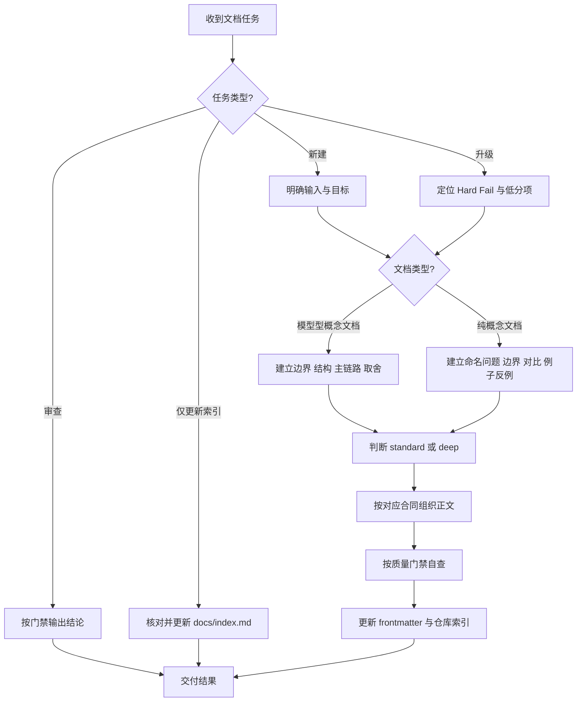

# 统一概念文档规范：新建、升级、审查与仓库集成

这份文件现在是 `docs/methodology/` 下的**主规范**。  
如果你的目标是新建、升级、审查或集成正式概念文档，默认先看这一份，而不是在多个方法论文档之间来回跳转。

其余文件仍然保留，但角色已经收束为：

- 需要更深入的学习方法背景时，看 `learning-new-things-playbook.md`
- 需要更深入的建模纪律时，看 `cognitive-modeling-playbook.md`
- 需要看完整模板骨架时，看 `concept-document-template.md`
- 需要看完整评分细则时，看 `concept-document-quality-gate.md`
- 需要确认候选稿的输入、输出、必需信息位点和出界边界时，看 `concept-document-contract.md`
- 需要先判断任务类型、资产层级、文档路径、深度、缺失输入和 `_bmad-output/` 边界时，看 `intake-and-intent-classification.md`
- 需要用合格/不合格样例校准 reviewer 证据判断时，看 `concept-document-example-catalog.md`
- 需要判断来源类型、当前实践、历史/废弃路径、不可验证声明和真实世界锚点是否合格时，看 `source-discipline-and-real-world-anchor-policy.md`
- 需要复制固定触发词时，看 `fixed-concept-generation-prompt.md`
- 需要看旧版编排说明时，看 `methodology-operator-guide.md`

一句话说：  
**这份文件负责执行合同，其他文件负责补充背景、细则和参考材料。**

从这次版本开始，这份主规范明确区分两条正式路径：

- 模型型概念文档
- 纯概念文档

## 1. 适用范围与边界

这份规范当前主要适用于：

- `docs/{topic}/` 下的正式知识库概念文档
- 现有概念文档的升级
- 概念文档的审查 / 验收
- 文档落盘后的仓库集成，包括 `docs/index.md`

这份规范当前**不直接覆盖**以下文档类型：

- 项目 README
- 教程 / 操作指南
- ADR / 决策记录
- API 参考
- 一次性报告

如果要系统支持这些类型，应该为它们补专用模板和门禁，而不是把概念文档规范无限扩张。

## 2. 核心目标

正式概念文档的目标，不是把一个词解释完就结束，而是建立一个可反复调用的理解资产。  
但这个资产不只有一种形态。

### 2.1 模型型概念文档

当一个主题本身具有稳定结构、机制、主链路、失败模式或选型价值时，文档应优先建立可复用内部模型，至少支持：

- 解释：能说清它在解决什么问题
- 预测：能推断某个条件变化后会发生什么
- 调试：出现异常时知道从哪里切入
- 取舍判断：知道它何时值得选、何时不该选
- 迁移：能把模型带到相邻问题上

### 2.2 纯概念文档

当一个主题本身更像：

- 基础概念
- 分类边界
- 命名区分
- 对比概念
- 上层模型会反复引用的核心术语

而不是一个独立机制时，文档可以走纯概念路径。

这类文档的主要目标不是硬造机制链，而是建立稳定的概念辨识力，至少支持：

- 解释：这个概念到底在命名什么
- 区分：它和相邻概念到底怎么分
- 分类：什么算它，什么不算它
- 纠错：常见误读、泛化和误用是什么
- 迁移：它后来会进入哪些更大的模型、判断或解释框架

### 2.3 默认禁止的坏写法

无论文档走哪条路径，默认都禁止下面这些形态：

- 术语解释
- 百科式摘要
- 只列定义、不建立边界或判断力的说明
- 只列章节、不提供真实结构的模板填空
- 为了满足模板而硬造伪机制、伪 tradeoff 或伪工业锚点

## 3. 先判断你在做什么

开始前，先判断请求是否属于正式概念文档工作。完整的 Knowledge 任务意图分类由 `docs/methodology/intake-and-intent-classification.md` 负责；如果请求已经明确属于正式概念文档工作，再把它归到四类之一：

- `新建`：仓库里还没有对应正式文档
- `升级`：仓库里已有文档，但结构、模型、时效或证据不足
- `审查`：你要判断一篇文档是否达标
- `仅更新索引`：正文不一定改，只补仓库导航

不要把这四种动作混成一次模糊请求。  
先分类，后执行，才能减少返工。

## 4. 一张图看完整流程

下面这张图是主流程，不是附加说明。



## 5. 新建文档规范

### 5.1 新建前的最小输入

至少先明确这些信息：

- 概念名 `concept`
- 所属主题 `topic`
- 你在什么场景下遇到它
- 你现在最不理解的点
- 你后续想拿它分析什么问题
- 它是否包含时间敏感内容
- 你希望看到哪些真实工业 / 现实世界锚点

如果这些输入不清楚，文档很容易滑向泛泛解释。

### 5.2 新建时先判断文档类型

在开始组织正文之前，先判断这篇文档更适合走哪条路径：

- `模型型概念文档`：主题本身具有稳定结构、主链路、机制、失败模式或选型价值
- `纯概念文档`：主题本身主要解决命名、分类、边界或相邻概念区分问题

这个判断先于 `standard` / `deep`。  
`standard` / `deep` 解决的是展开密度问题，不解决“这篇文档到底该不该强写机制链”的问题。

### 5.3 如果是模型型概念文档，新建前必须先完成的建模动作

至少先回答：

- 它到底在解决什么问题
- 它的边界在哪里，不是什么
- 它由哪些关键结构构成
- 它如何运转，主链路或因果链是什么
- 它的关键 tradeoff 是什么
- 它在什么条件下失效
- 现实里谁在关心它，为什么关心
- 如果后续要验证是否真的理解了，应从哪里下手

### 5.4 如果是纯概念文档，新建前必须先完成的判别动作

至少先回答：

- 这个概念到底在命名什么，为什么需要单独命名
- 它试图消除的混淆、分类问题或命名空洞是什么
- 它的边界在哪里，哪些对象算它，哪些不算
- 它最容易和哪些相邻概念混淆
- 哪些例子、反例和误用最能帮助辨识它
- 它在后续会进入哪些更大的模型、判断或解释框架
- 如果后续要验证是否真的理解了，应从哪里下手

如果这些问题没有先回答，后面的写作只是排版，不是理解资产构建。

## 6. 升级旧文档规范

升级默认遵守一条原则：  
**保留高价值内容，优先补结构和判断能力，不要为了“统一风格”整篇推倒重写。**

升级时的标准顺序：

1. 先按质量门禁找 Hard Fail 和低分项
2. 再判断这篇文档应走模型型概念文档还是纯概念文档路径
3. 再判断该主题应该按 `standard` 还是 `deep` 审视
4. 再补对应路径下的结构缺口、验证入口和迁移入口
5. 再补工业锚点、当前实践、旧路径与替代路径，或删除本来就不该硬写的伪章节
6. 最后更新 `updated_at`、必要的 `source_basis`、`time_context` 和 `docs/index.md`

升级时优先补的缺口是：

- 问题定义不清
- 对象边界不清
- 把纯概念硬写成伪机制文档，或把模型型主题误降成术语说明
- 对模型型主题缺少核心机制 / 主链路 / 因果链
- 对纯概念主题缺少分类边界、例子 / 反例和误读纠偏
- tradeoff、失败模式或误读点写得太虚
- 工业锚点不真实或不可定位
- 当前实践没有日期或来源纪律
- 没有自测题 / 验证入口
- 没有迁移入口
- 没有未解问题

## 7. 先判断文档类型，再判断展开密度

### 7.1 模型型概念文档

更适合下面这类对象：

- 本体就是一个机制、协议、结构或系统对象
- 读者后续要拿它做预测、调试、取舍或选型
- 如果不写主链路，就无法真正理解它
- 失败模式和 tradeoff 本身构成理解核心

### 7.2 纯概念文档

更适合下面这类对象：

- 本体更像一个分类概念、边界概念、命名区分或对比概念
- 主要困难不在“它怎么运转”，而在“它到底在说什么、和什么不同”
- 强行写机制链只会制造假结构
- 文档的主要价值是帮助后续阅读更大模型时不再混淆术语

目前不要求为这两类路径新增单独 frontmatter 字段。  
但在新建、升级和审查时，必须先显式做这个判断。

### 7.3 `standard`

更适合下面这类对象：

- 单主机制
- 单时间尺度
- 边界清楚
- 或相邻概念集合较小、判别负担较低
- 主要目标是建立稳定定义、边界和最小判断力

### 7.4 `deep`

更适合下面这类对象：

- 多层抽象同时存在
- 多参与方、多后端或多执行面同时存在
- 当前实践与历史路径都重要
- 相邻概念很多，误读路径很多，边界网络本身就复杂
- 文档会被用于选型、排障、架构判断，而不只是记忆
- 失败模式和 tradeoff 本身比定义更关键

如果一个主题命中上面两条及以上，默认按 `deep` 写。

### 7.5 `deep` 模式的额外要求

`deep` 不是篇幅更长，而是判断支撑更强。  
至少额外做到：

- 如果是模型型概念文档：
  - `核心结构` 必须是层次或分面框架，而不只是名词列表
  - `核心机制` 至少给出一条完整端到端链路；必要时补变体链路
  - `应用场景` 至少给出 `3` 类有差异的使用场景
  - `工业 / 现实世界锚点` 至少给出 `2` 个真实对象，并解释为什么能作为锚点
  - `当前推荐实践、过时路径与替代` 不能只报结论，必须写清原因链
  - `自测题 / 验证入口` 不能只停留在术语回忆
- 如果是纯概念文档：
  - 必须把相邻概念网络展开到足以稳定区分
  - 至少给出一组代表性例子和一组反例或误用
  - 必须写清最常见的误读、过度泛化或错误类比
  - 必须写清它会进入哪些更大的模型、解释框架或后续判断
  - 如果涉及时间敏感用法或现实语境，再补当前实践与来源纪律；不涉及时不要硬塞

## 8. 正式概念文档的统一合同

### 8.1 必需 frontmatter

正式概念文档默认至少包含：

- `doc_id`
- `title`
- `concept`
- `topic`
- `depth_mode`
- `created_at`
- `updated_at`
- `source_basis`
- `time_context`
- `applicability`
- `prompt_version`
- `template_version`
- `quality_status`
- `related_docs`
- `open_questions`

### 8.2 必需信息位点按文档类型分流

所有正式概念文档都至少要回答：

1. 这份文档要帮你学会什么
2. 一句话结论 / 问题定义，或一条清晰的命名 / 分类结论
3. 边界与相邻概念
4. 自测题 / 验证入口
5. 迁移与关联模型
6. 未解问题与继续深挖
7. 参考资料

如果是模型型概念文档，默认还应覆盖：

1. 核心结构
2. 核心机制 / 主链路 / 因果链
3. 关键 tradeoff 与失败模式
4. 应用场景
5. 工业 / 现实世界锚点
6. 当前推荐实践、过时路径与替代

如果是纯概念文档，默认还应覆盖：

1. 这个概念试图解决的命名、分类或区分问题
2. 什么算它，什么不算它
3. 代表性例子、反例与常见误用
4. 它最容易与哪些相邻概念混淆
5. 它会进入哪些更大的模型、解释或判断框架

纯概念文档只有在这些内容真的属于概念本体时，才补“机制链”“tradeoff”“工业锚点”或“当前实践”。

标题不必逐字照抄，但对应路径下的信息位点不能缺。

### 8.3 时间敏感内容的纪律

只要正文讨论以下内容，就必须显式遵守时间与来源纪律：

- 当前实践
- 当前产品行为
- 当前标准或制度
- 已过时路径与替代建议

至少做到：

- 在正文里写明核对日期
- 优先使用一手或官方来源
- 区分事实、推断和建议
- 让 `time_context`、`source_basis` 与正文一致

### 8.4 真实锚点纪律

工业 / 现实世界锚点不能写成抽象口号。  
至少要能定位到：

- 真实组织
- 真实系统
- 真实产品
- 真实标准
- 真实制度

并解释：

- 为什么这个对象能作为锚点
- 工程或现实里为什么关心它
- 理解错后会造成什么判断偏差

## 9. 质量门禁的统一基线

完整门禁以 `docs/methodology/concept-document-quality-gate.md` 为准。
本节只保留主规范中的执行摘要，避免主流程和完整门禁互相矛盾。

正式审查必须先输出前置分类，再执行 Hard Fail，再评分，最后给出审查结论和允许状态。前置分类至少包括：

- 任务类型：新建、升级、审查、仅更新索引、迁移/废弃或规范维护
- 资产层级：普通概念文档、方法论资产、治理资产、模板、索引、runbook、workflow output 或报告
- 文档路径类型：模型型概念文档、纯概念文档或不适用
- 展开密度：`standard`、`deep` 或不适用

缺少前置分类时，审查结论无效。

### 9.1 Hard Fail

命中任意一条，就不能视为正式合格稿，也不得宣称 ready、accepted、validated、`upgraded_v1`、`maintained_asset` 或等价通过状态。

Hard Fail 至少覆盖：

- 仓库集成：canonical 路径、`kebab-case` 文件名、稳定 `doc_id`、索引影响、changed-file links、`related_docs` 与正文链接
- 必需 frontmatter：必填字段、数组字段、`depth_mode`、source/time/version/status 与正文一致性
- 文档类型结构：模型型文档的问题定义、对象边界、核心结构、机制链、tradeoff/失败模式、验证入口和迁移入口；纯概念文档的命名/分类问题、什么算/不算、相邻概念、例子/反例/误读、验证入口和迁移入口
- 边界清晰度：对象边界、相邻概念、误等价、适用条件、失效条件和可判别性
- 来源依据与真实世界锚点：真实可定位对象、当前实践、历史路径、来源限制和事实/推断区分
- 时间语境与一致性：`updated_at`、`time_context`、`source_basis`、正文、索引、链接和审查结论互相一致

每个 Hard Fail 输出都必须包含失败条件、证据位置、为什么阻塞和修复指导。

### 9.2 六项评分

没有 Hard Fail 的前提下，再按 `0-2` 分评分。分数不能抵消 Hard Fail。对治理、方法论、模板、索引、runbook 或 workflow output 等非概念资产，跳过概念文档六项评分，改用角色、权威、范围、frontmatter、来源/时间语境、索引/链接、版本记录和 workflow contract fit 的等价治理检查。

- 问题定义与边界
- 结构与因果 / 判别框架
- Tradeoff / 失败模式 / 误读纠偏
- 真实世界锚点 / 当前实践
- 验证 / 迁移
- 元数据 / 仓库纪律

评分解释：

- `10-12` 分且无 Hard Fail：可通过当前质量门禁，并可考虑 `upgraded_v1` 或相应通过结论
- `7-9` 分且无 Hard Fail：可保留或进入受控修订，但不建议标 `upgraded_v1`、`validated` 或强通过状态
- `0-6` 分或有 Hard Fail：应退回补强

`standard` 要求稳定理解和最小复用；`deep` 要求更强的信息密度、判断支撑、来源纪律、失败模式和迁移能力，不是只要求篇幅更长。

### 9.3 质量状态与审查结论

`quality_status`、生命周期状态和 BMad story 状态必须分开理解。

当前兼容的 `quality_status` 值包括 `draft`、`reviewed`、`validated`、`maintained_asset`、`upgraded_v1`、`deprecated` 和 `archived`。其中 `upgraded_v1` 是既有概念文档质量信号，不是完整生命周期状态；`maintained_asset` 适用于 active methodology/governance/template/index/support asset，前提是角色、权威、版本、来源/时间语境、链接和维护触发点仍当前。

审查结论应单独表达，例如 `blocked_by_hard_fail`、`needs_revision`、`accepted_for_current_use`、`validated_candidate` 或 `hold_for_maxwell_confirmation`。本规范不授权批量改写既有文档的 `quality_status`。

## 10. 审查输出必须长成什么样

每次正式审查，输出结构保持稳定：

- `前置分类`：任务类型、资产层级、模型型/纯概念/不适用路径、`standard`/`deep`/不适用及依据
- `Hard Fail`：是否命中；每项必须包含失败条件、证据位置、为什么阻塞和修复指导
- `文档类型判定`：模型型概念文档还是纯概念文档，以及依据
- `复杂度判定`：按 `standard` 还是 `deep` 审视，以及依据
- `六项评分`：逐项 `0-2`；非概念资产写明不适用，并输出等价治理检查
- `必改项`：不改就不能过门禁
- `可改进项`：不影响过门禁，但能显著提高复用性
- `最终结论`：审查决策、是否允许通过状态、是否允许改 `quality_status`、index/link/version/lifecycle 影响、approved deviations 与 unresolved risks

不要只给“整体不错”或“建议更完整”这类软评价。

## 11. 仓库集成规范

概念文档只有在完成仓库集成后，才算真正完成。  
至少要检查：

- 路径是否正确
- 文件名是否正确
- frontmatter 是否完整且一致
- 标题、路径、`topic` 是否一致
- 新增正式文档后是否更新 `docs/index.md`
- 若路径、标题或 topic 改变，是否同步更新索引

## 12. 版本治理记录

Story 1.2 将本主规范从 `unified_spec_v1` 提升为 `unified_spec_v2`。最小版本变更记录如下：

```yaml
version_change_record:
  changed_asset: docs/methodology/document-generation-methodology.md
  old_value: unified_spec_v1
  new_value: unified_spec_v2
  change_type: methodology
  reason: Story 1.2 将正式概念文档入口接到 intake and intent classification，并同步审查前置分类与等价治理检查摘要
  affected_docs_or_assets:
    - docs/methodology/document-generation-methodology.md
    - docs/methodology/intake-and-intent-classification.md
    - docs/methodology/concept-document-quality-gate.md
    - docs/methodology/fixed-concept-generation-prompt.md
  expected_generation_impact: 正式概念文档新建、升级、审查或索引动作前，先确认请求属于正式概念文档工作；任务意图、资产层级或缺失输入不清时转入 intake asset
  expected_review_impact: 正式审查必须输出前置分类；非概念资产使用等价治理检查而不是概念文档六项评分
  migration_plan: targeted_review
  index_navigation_impact: none
  lifecycle_quality_status_impact: none
  approved_deviations: []
  unresolved_risks:
    - "Epic 2 尚未定义独立 methodology_version/frontmatter schema；当前用 template_version 表达主规范规则集"
```

## 13. 固定触发词

如果你只是想直接执行任务，默认用这四段入口：

### 13.1 新建文档

```text
为概念 {concept} 新建一篇知识库文档。按 docs/methodology/document-generation-methodology.md 执行：先判断它应走模型型概念文档还是纯概念文档路径，再判断 standard 或 deep；如果是模型型，建立可复用内部模型；如果是纯概念，建立稳定的概念辨识资产，不要硬造机制链。写入合适的 docs/{topic}/ 目录，补齐 frontmatter，并在完成后更新 docs/index.md。
```

### 13.2 升级旧文档

```text
按 docs/methodology/document-generation-methodology.md 升级现有文档 {path}。保留原有高价值内容，先找 Hard Fail 和低分项，再判断它应走模型型概念文档还是纯概念文档路径；补对应结构、自测题、迁移入口和仓库集成，并删除那些只是为了套模板而硬写出来的伪机制、伪 tradeoff 或伪锚点。
```

### 13.3 审查 / 验收

```text
按 docs/methodology/document-generation-methodology.md 审查文档 {path}。先输出前置分类：任务类型、资产层级、模型型概念文档/纯概念文档/不适用、standard/deep/不适用。再按 docs/methodology/concept-document-quality-gate.md 输出 Hard Fail 证据与修复指导、六项评分或等价治理检查、必改项、可改进项、最终审查决策、允许的 quality_status、index/link/version/lifecycle 影响和未解决风险。任意 Hard Fail 存在时，不得宣称 ready、accepted、validated、upgraded_v1 或 maintained_asset。
```

### 13.4 仅更新索引

```text
检查 docs/index.md 是否已经正确收录 {path}。如果没有，按现有 topic 分组补入，并保持标题、路径和主题一致。
```

## 14. 参考件如何使用

如果主规范已经能满足任务，不必强制回读所有参考文件。  
只有在下面这些场景里，再进入参考件：

- 你需要更完整的学习策略时，读 `learning-new-things-playbook.md`
- 你需要更强的建模约束时，读 `cognitive-modeling-playbook.md`
- 你要看完整章节骨架或分型规则时，读 `concept-document-template.md`
- 你要看完整 Hard Fail 与评分细则时，读 `concept-document-quality-gate.md`
- 你要确认候选稿生成的输入、输出、必需信息位点或出界输出时，读 `concept-document-contract.md`
- 你要判断任务类型、资产层级、缺失输入、`_bmad-output/` 边界或 batch routing 时，读 `intake-and-intent-classification.md`
- 你要用 passing/failing examples 校准 Hard Fail、六项评分证据和 reviewer action 倾向时，读 `concept-document-example-catalog.md`
- 你要细查 current-practice claim、historical/deprecated practice、source labels、unverifiable claims 或 real-world anchor adequacy 时，读 `source-discipline-and-real-world-anchor-policy.md`
- 你要复制固定入口原文时，读 `fixed-concept-generation-prompt.md`

默认路径应该是：

1. 先看本规范
2. 直接执行
3. 只有卡住时，再下钻参考件
